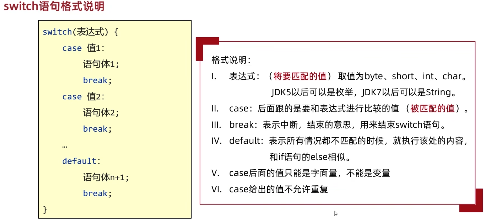

#  Tips:

运行代码 control+option+n(VScode)  control+shift+r(IDEA);  

java类名和文件名需要保持一致

变量的批量修改 shift+f6

快速生成构造方法command + n / alt +insert / 插件ptg

快速生成option + command + v

public static void main简写psvm

for (int i = 0; i < ; i++) {}简写fori

for (int i = 0; i < strA.length(); i++) {}可以转化为StrA.length().fori

上下移动代码行shift+option+⬆️/⬇️

查找类文件/源代码文件 control+n(Windows)  command+o(MAC)

快速转换大小写command+shift+u

输入对勾 option+v

智能提示/修复 option+enter

查看方法源码 command+b

快速抽取成方法 command + option + m(mac)    control + m(windows)

Java中的相对路径从模块名开始   eg：“puzzleGame/image/background.png”

向下复制一行 command+d

查找类里面所有的方法 command + fn + f12

# Java基础概念

## 1、JDK和JRE


## 2、字面量


## 3、变量

### 变量的注意事项


### 不同进制在代码中的表现形式


## 4、数据类型
如果要定义long类型的变量，需要在数据值的后面添加一个L作为后缀，L大小写都可`long n = 999999999L`  
定义float类型的变量，数据值需要一个F作为后缀  


## 5、标识符
  


## 6、键盘输入

### (1)键盘录入介绍

  
```java
import java.util.Scanner;
public class demo {
    public static void main(String[] args) {
        Scanner sc = new Scanner(System.in);
        int i = sc.nextInt();
        System.out.println(i);
    }
}
```

### (2)键盘录入的两套体系

~~~~~~java
//第一套体系：

// nextInt()；接收整数

// nextDouble();接收小数

// next();接收字符串

// 遇到空格，制表符，回车就停止接受。这些符号后面的数据就不会接受了

// 第二套体系：

// nextLine();接收字符串

// 可以接收空格，制表符，遇到回车才停止接受数据

// 先用nextInt、nextDouble()、next()会导致下面的nextLine接收不到数据，谨慎放在一起用
~~~~~~


## 7、IDEA项目结构

project->module->package->class

# 运算符

## 1、隐式转换
小数参与运算可能会得到不精确的结果  
数字进行运算时，数据类型不一样不能运算，需要先进行转换  
隐式转换：把一个取值范围小的数值，转换为取值范围大的数据byte->short->int->long->float->double  


## 2、强制转换

强制转换有可能会使数据发生错误

```java
int a = 300;
byte b = (byte)a;
```


## 3、字符串+操作


## 4、字符的+操作

当字符+字符或者字符加数字时，会首先把字符通过ASCII码表转换为对应的数字在进行计算

## 5、赋值运算符

```java
short s = 1;
s += 1;
// 等同于 s = (short)(s+1)
// += -+ *= /= %=底层都包含了一个强制类型转换
```

## 6、逻辑运算符


短路逻辑运算符&& ||，与上述&运算结果相同，当左边的表达式能够确定最终的结果，右边就不会参与运算，而&无论左边true or false，右边都要参与执行

# 判断和循环

## 1、switch语句



default不一定写在最下面，可以写在任意位置，可以省略

switch新特性1：

~~~~~~java
int number = 1;
switch (number){
    case 1 ->{
        System.out.println("1");
    }
    case 2 ->{
        System.out.println("2");
    }
    case 3 ->{
        System.out.println("3");
    }
    default ->{
        System.out.println("4");
    }
}

int number = 1;
switch (number) {
    case 1 -> System.out.println("1");
    case 2 -> System.out.println("2");
    case 3 -> System.out.println("3");
    default -> System.out.println("4");
    
int number = 1;
switch (number) {
    case 1, 2, 3, 4, 5 -> System.out.println("工作日");
    case 6, 7 -> System.out.println("休息日");
    default -> System.out.println("error");
~~~~~~

switch新特性2:

``````java
public static String changeLuoMa(char number) {
    String str = switch (number) {
        case '0' -> "";
        case '1' -> "I";
        case '2' -> "II";
        case '3' -> "III";
        case '4' -> "IV";
        case '5' -> "V";
        case '6' -> "VI";
        case '7' -> "VII";
        case '8' -> "VIII";
        case '9' -> "IX";
        default -> str = "";
    };
    return str;
}
``````

## 2、获取随机数


```java
import java.util.Random;

public class test_02 {
    public static void main(String[] args) {
        Random r = new Random();
        int a = r.nextInt(10);
    }
}
```

# 数组

## 1、定义


## 2、数组的静态初始化


~~~~~~java 
// 简化格式 数组类型[] 数组名 = {元素1, 元素2, 元素3}
int []arr1 = new int[]{11,12,23,12};
int []arr2 = {11,12,23,12};
System.out.println(arr2);   
// 会打印数组的地址值[I@2a84aee7
// [表示当前是一个数组，I表示数组元素是int类型，@表示一个间隔符号，a84aee7才是真正的十六进制地址值
~~~~~~

## 3、数组遍历

数组名.length

在idea中，可以使用数组名.fori快速生成数组的遍历方式

## 4、数组的动态初始化


```java
String[] arr = new String[50];
```

在创建的时候，有我们自己指定数组的长度，由虚拟机给出默认的初始化值

​	整数类型：0

​	小数类型：0.0

​	字符类型：'/u0000'空格

​	布尔类型：false

​	引用数据类型：null

## 5、数组动态初始化和静态初始化的区别


## 6、Java内存分配


为了便于理解，继续使用方法区


## 7、二维数组

### （1）二维数组静态初始化


### （2）二维数组动态初始化


``````java
int[][] arr = new int[2][];
int[] arr1 = {11, 22};
int[] arr2 = {44, 55, 66};
arr[0] = arr1;
arr[1] = arr2;
``````


# 方法

## 1、简介


## 2、方法的注意事项


## 3、方法的重载


## 4、基本数据类型和引用数据类型


# 面向对象

## 1、基础概念


用来描述一类事物的类，专业叫做：Javabean类，在javabean类中，是不写main方法的。

在以前，编写main方法的类，叫做测试类，我们可以在测试类中创建javabean类的对象并进行赋值调用。

一个java文件中可以定义多个class类，且只能一个类用public修饰，而且public修饰得类名必须成为代码文件名。

实际开发中建议还是一个文件定义一个class类。


## 2、封装


## 3、private关键字


## 4、构造方法


``````java
// 如果没有写任何的构造方法，虚拟机会自动加一个空参构造
``````


## 5、标准JavaBean

快速生成构造方法command + n / alt +insert / 插件ptg


## 6、对象内存图


## 7、this的作用和原理

this的作用：区分局部变量和成员变量

this的本质：所在方法调用者的地址值

## 8、成员变量和局部变量的区别


# 字符串

## 1、API


## 2、String概述

字符串的内容是不会发生改变的，他的对象在创建后不能更改，对字符串的重新赋值实际上是创建了一个新的字符串


## 3、创建String对象

### (1)创建String对象的两种方式


``````java
//1.使用直接赋值的方式获取一个字符串对象
String s1 = "abc";
System.out.println(s1);//abc

//2.使用new的方式来获取一个字符串对象
//空参构造：可以获取一个空白的字符串对象
String s2 = new String();
System.out.println("@" + s2 + "!");//""

//传递一个字符串，根据传递的字符串内容再创建一个新的字符串对象
String s3 = new String("abc");
System.out.println(s3);

//传递一个字符数组，根据字符数组的内容再创建一个新的字符串对象
//需求：我要修改宇符串的内容。 abc gbc
//abc-->{'a','b','c'1-->{'q',b',’c'1-->"gbc"
char[] chs = {'a', 'b', 'c', 'd'};
String s4 = new String(chs);
System.out.println(s4);//abed
//传递一个字节数组，根据字节数组的内容再创建一个新的字符串对象
//应用场景：以后在网络当中传输的数据其实都是字节信息
//我们一般要把字节信息进行转换，转成字符串，此时就要用到这个构造了。
byte[] bytes = {97, 98, 99, 100};
String s5 = new String(bytes);
System.out.println(s5);//abcd,ASCII码
``````

### (2)不同方法创建字符串的内存区别

StringTable（串池）在JDK7版本开始由方法去挪到了内存区

当使用双引号直接复制时，系统会检查该字符串在串池中是否存在，不存在则创建新的，否则复用

使用new方法创建的字符串开辟在堆区

## 4、字符串比较

### (1)==比较的是什么


### (2)equals和equalsIgnoreCase方法

``````java
//1.创建两个字符串对象
String s1 = new String("abc");
String s2 = "abc";

//2.==号比较
//基本数据类型：比的是数据值
// 引用数据类型：比的是地址值
System.out.println(s1 == s2);//false

//3.比较宇符串对象中的内容是否相等
boolean result1 = s1.equals(s2);//true
System.out.println(result1);

//4.比较宇符串对象中的内容是否相等(忽略大小写)
boolean result1 = s1.equalsIgnoreCase(s2);//true
System.out.println(result1);
``````

## 5、遍历字符串

```java
// 数组的长度是length，字符串的长度是方法length()
// 字符串索引需使用方法charAt()
for (int i = 0; i < str.length(); i++) {
    char ch = str.charAt(i);
}
```

## 6、字符串和替换

~~~~~~java
// 左开右闭
String substring(int beginIndex,int endIndex);
// 截取到末尾
String substring(int beginIndex);
// 字符串替换
String replace(旧值,新值);
 
~~~~~~

## 7、StringBuilder

### (1) 概述

StringBuilder可以看作一个容器，创建之后里面的内容是可变的，用于提高字符串的操作效率

### (2)StringBuilder构造方法

``````java
// 空参构造，创造一个空白可变的字符串对象，不含有任何内容
public StringBuilder()

// 根据字符串内容，来创建可变字符串对象
public StringBuilder()
``````

### (3)StringBuilder成员方法


```java
// 因为stringBuilder是Java己经写好的类
// java在底层对他做了一些特殊处理。打印对象不是地址值而是属性值。
StringBuilder sb = new StringBuilder();
System.out.println(sb);
```

### (4)使用StringBuilder的场景

字符串的拼接

字符串的反转 

## 8、StringJoiner

### (1)StringJoiner概述

StringJoiner和StringBuilder一样都可以看做一个容器，创建之后里面的内容是可变的。

用于提高字符串的操作效率，编写的代码简洁

JDK8之后才出现


### (2)StringJoiner的构造方法 


### (3)StringJoiner的成员方法


## 9、字符串原理

### (1)字符串存储的内存原理

直接赋值会复用字符串常量池中的

new出来不会复用，而是开辟一个新的空间

### (2)==比较的到底是什么

基本数据类型比较数据值

引用数据类型比较地址值

### (3)字符串拼接的底层原理

#### 拼接的时候无变量参与


#### 拼接的时候有变量参与

JDK8以前：使用StringBuilder实现


JDK8 :使用字符数组实现


#### 结论

字符串拼接的时候有变量参与，在内存中创建了很多对象，浪费空间，时间也非常慢

如果很多宇符串变量拼接，不要直接+，在底层会创建多个对象，浪费时间，浪费性能。


### (4)StringBuilder提高效率原理图


### (5)StringBuilder源码分析

首先默认创建一个长度为16的字节数组；

添加的内容长度小于16，直接存；

添加的内容大于16会扩容（原来的容量*2+2）；

如果扩容之后还不够，以实际长度为准

### (6)面试题


### (7)小结


### 10、字符串的一些成员方法

~~~~~~java
char[] arr = str.toCharArray();     //将字符串转换为字符数组
~~~~~~

# 集合

## 1、集合和数组的区别

数组：数组长度固定，既可以存基本数据类型，也可以存应用数据类型

集合：集合长度可变，可以存引用数据类型，但存储基本数据类型需要用包装类来解决

## 2、集合的构造方法

```java
//泛型：限定集合中存储数据的类型
ArrayList<String> list1 = new ArrayList<String> ();
//JDK7:
ArrayList<String> list2 = new ArrayList<>();
//此时我们创建的是ArrayList的对象，而ArrayList 是java己经写好的一个类
//这个类在底层做了一些处理
//打印对象不是地址值，而是集合中存储数据内容
//在展示的时候会拿[]把所有的数据进行包裹
System.out.printIn(list);
```

## 3、集合的成员方法


## 4、基本数据类型对应的包装类

``````java
byte Byte
short Short
char Character
int Integer
long Long
float Float
double Double
boolean Boolean
``````

```java
ArrayList<Integer> list = new ArrayList<>();
//JDK5以后int Integer可以相互转化
list.add(1);
list.add(2);
list.add(3);
list.add(4);
System.out.print("[");
for (int i = 0; i < list.size(); i++) {
    if (i == list.size() - 1) {
        System.out.println(list.get(i));
    } 
    else{
        System.out.print(list.get(i) + ",");
    }
}
System.out.println("]");
```