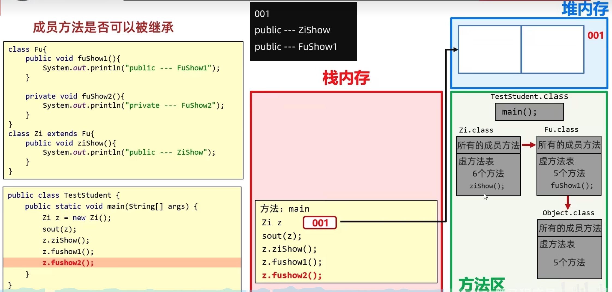

# static

## 1、静态变量

被static修饰的成员变量称为静态变量，静态变量是随着类的加载而加载的，优先于对象出现的

### (1)特点与调用方式

特点：被该类所有对象共享

不属于对象，属于类，随着类的加载而加载，优先于对象存在

调用方式：

类名调用（推荐）、对象名调用


### (2)static内存图


## 2、静态方法

特点：

​	多用在测试类和工具类当中

​	Javabean类中很少使用

调用方式：

​	类名调用（推荐）

​	对象名调用

## 3、工具类

### (1)三种类

Javabean类：用来描述一类事物的类。比如，Student,, Teacher, Dog, Cat等

测试类：用来检查其他类是否书写正确，带有main方法的类，是程序的入口

工貝类：不是用来描述一类事物的，而是帮我们做一些事情的类。

### (2)工具类的

类名见名知意

私有化构造方法

方法定义为静态

## 4、static的注意事项

静态方法只能访问静态变量和静态方法

非静态方法可以访问静态变量或者静态方法，也可以访问非静态的成员变量和非静态的成员方法

静态方法中是没有this关键字

静态方法中，只能访问静态

非静态可以访问所有

静态中没有this关键字

## 5、总结


## 6、重新认识main方法


# 继承

## 1、继承概述

### (1)继承的定义与好处


### (2)使用继承的时机

当类与类之间存在相同（共性）的内容，并满足子类是父类的一种，就可以考虑继承，来优化代码

### (3)小结


## 2、继承的特点

Java**只支持单继承，不支持多继承**，但支持多层继承

多层继承：子类A继承父类B，父类B可以继承父类C

Java中每一个类都直接或者间接的继承于Object类

直接父类/间接父类

子类只能访问父类中非私有的成员

## 3、子类到底能继承父类中的哪些内容

私有成员变量可以被继承、但是不能被使用


 




## 4、虚方法

非private、非static、非final修饰的方法

## 5、继承中：成员变量的访问特点

就近原则：谁离我近，我就用谁

``````java
public class Fu {
    String name = "Fu";
}

public class Zi extends Fu {
    String name = "Zi";
    public void zishow() {
        String name = "zishow";
        System.out.println(name);         //zishow从局部位置开始往上找
        System.out.println(this.name);    //Zi从本类成员位置开始往上找
        System.out.println(super.name);   //Fu从父类成员位置开始往上找
    }
}
``````


## 6、继承中：成员方法的访问特点

 ### (1)访问规则

直接调用满足就近原则

super调用，直接访问父类

### (2)方法的重写

当父类的方法不能满足子类现在的需求时，需要进行方法重写

书写格式：在继承体系中，子类出现了和父类中一模一样的方法声明，我们就称子类这个方法是重写的方法。

#### @override重写注解

1.@overricle是放在重写后的方法上，校验子类重写时语法是否正确。

2.加上注解后如果有红色波浪线，表示语法错误。

3.建议重写方法都加@Override注解，代码安全，优雅！  

``````java
@Override
public void eat() {
	System.out.printin(“吃意大利面”)；
}
``````

#### 方法重写的本质

子类覆盖了从父类继承来的虚方法表里的方法

#### 方法重写注意事项和要求

1.重写方法的名称、形参列表必须与父类中的一致。

2.子类重写父类方法时，访问权限子类必须大于等于父类（暂时了解：空着不写 < protected < public)

3.子类重写父类方法时，返回值类型子类必须小于等于父类

4.建议：重写的方法尽量和父类保持一致。

5.只有被添加到虛方法表中的方法才能被重写

### (3)小结

#### 继承中成员方法的访问特点：

this调用：就近原则。

super调用：直接找父类。

#### 什么是方法重写？

在继承体系中，子类出现了和父类中一模一样的方法声明，

我们就称子类的这个方法是重写的方法。

#### 方法重写建议加上哪个注解，有什么好处？

@override注解可以校验重写是否正确，同时可读性好。

#### 重写方法有哪些基本要求？

子类重写的方法尽量跟父类中的方法保持一致。

只有虛方法表里面的方法可以被重写

#### 方法重写的本质？

覆盖虚方法表中的方法

## 7、继承中：构造方法特点


#### 继承中构造方法的访问特点是什么？

子类不能继承父类的构造方法，但是可以通过super调用

子类构造方法的第一行，有一个默认的super()；

默认先访问父类中无参的构造方法，再执行自己。

如果想要方法文父类有参构造，必须手动书写。

## 8、this、super使用总结


#### this()访问本类构造方法

一般在给数据赋默认值时使用

``````java
class Student {
    String name;
    int age;
    String school;

    //需求：
    //默认为传智大学
    public Student() {
        //表示调用本类其他构造方法
        //细节：虛拟机就不会再添加super();
        //必须写在第一行
        this(null, 0, "传智大学");
    }

    public Student(String name, int age, String school) {
        this.name = name;
        this.age = age;
        this.school = school;
    }
}
``````

# 多态

## 1、概念

### (1)什么是多态？

同类型的对象，表现出的不同形态。

### (2)多态的表现形式

父类类型 对象名称 = 子类对象；

### (3)多态的前提

有继承关系

有父类引用指向子类对象. ` Fu f= new zi ()`

有方法重写

### (4)多态的优势

使用父类型作为参数，可以接受所有子类对象，体现多态的扩展性和便利

## 2、多态调用成员的特点

调用成员变量的特点：编译看左边，运行也看左边

调用成员函数的特点：编译看左边，运行看右边

```java
public class Test {
    public static void main(String[] args) {
        //创建对象（多态方式）
        //Fu f = new Zi();
        Animal a = new Dog();
        //调用成员变量：编译看左边，运行也看左边
        //编译看左边：javac编译代码的时候，会看左边的父类中有没有这个变量，如果有，编译成功，如果没有编译失败。
        //运行也看左边：java运行代码的时候，实际获取的就是左边父类中成员变量的值
        System.out.println(a.name);//动物

        //调用成员方法：编译看左边，运行看右边
        //编译看左边：javac编译代码的时候，会看左边的父类中有没有这个方法，如果有，编译成功，如果没有编译失败。
        //运行看右边：java运行代码的时候，实际上运行的是子类中的方法。
        a.show();///Dog --- show方法

        //理解：
        //Animal a = new Dog();
        //现在用a去调用变量和方法的呀？是的
        //而a是Animal类型的，所以默认都会从Animal这个类中去找

        //成员变量：在子类的对象中，会把父类的成员变量也继承下的。父：name  子：name
        //成员方法：如果子类对方法进行了重写，那么在虚方法表中是会把父类的方法进行覆盖的。
    }
}


class Animal{
    String name = "动物";

   public void show(){
        System.out.println("Animal --- show方法");
    }
}

class Dog extends Animal{
    String name = "狗";

    @Override
    public void show() {
        System.out.println("Dog --- show方法");
    }

}

class Cat extends Animal{
    String name = "猫";

   @Override
    public void show() {
        System.out.println("Cat --- show方法");
    }
}
```


## 3、多态的优势和缺陷

### (1)优势

在多态形式下，右边对象可以实现解耦合，便于扩展和维护。

``````java
Person p = new Student ()；
p.work()；//业务逻辑发生改变时，后续代码无需修改
``````

定义方法的时候，使用父类型作为参数，可以接收所有子类对象，体现多态的扩展性与便利。

### (2)缺陷

 不能调用子类特有功能

解决方案：转换为子类类型

``````java
Animal a = new Dog();
a.eat();         //打印“动物在吃饭”
a.lookhome();    //报错，在编译的过程中首先检查父类中有没有这个方法，没有则直接报错

//解决方案：变回子类类型
Dog d = (Dog)a;
d.lookhome();      
//报错，转换的时候不能瞎转
Cat c = (Cat)a;
c.catchMouse();

//判断a是否是Dog类型
if (a instanceof Dog) {
    Dog d = (Dog) a;
    d.lookHome();
//判断a是否是Cat类型
} else if (a instanceof Cat) {
    Cat c = (Cat) a;
    c.catchMouse();
} else {
    System.out.println("没有这个类型，无法转换");
}

//新特性
//先判断a是否为Dog类型，如果是，则强转成Dog类型，转换之后变量名为d
//如果不是，则不强转，结果直接是false
if (a instanceof Dog d) {
		d.lookHome();
} else if (a instanceof Cat c) {
    c.catchMouse();
} else {
    System.out.println("没有这个类型，无法转换");
}
``````

### (3)小结


# 包、final、权限修饰符、代码块


## 1、包

### (1)定义


### (2)使用其他类的规则

使用同一个包中的类时，不需要导包

使用java.lang包中的类时，不需要导包

其他情况都需要导包

如果同时使用两个包中的同名类，需要用全类名

``````java
public class Test {
		public static void main(String[] args) {
				com.itheima.domain.Student s = new com.itheima.domain.Student ();
}
``````

等价于

``````java 
import com.itheima.domain.Student
public class Test {
		public static void main(String[] args) {
				Student s = Student ();
}
``````

### (3)小结

#### 包的作用？

包就是文件夹，用来管理各种不同功能的ava类

#### 包名书写的规则？

公司域名反写＋ 包的作用，需要全部英文小写，见名知意

#### 什么是全类名？

包名＋类名

#### 什么时候需要导包？什么时候不需要导包？

使用同一个包中的类时，不需要导包。

使用java.lang包中的类时，不需要导包。

其他情况都需要导包。

如果同时使用两个包中的同名类，需要用全类名。

## 2、final关键字

### (1)final修饰规则

final修饰方法：表明该方法是最终方法，不能被重写

final修饰类：表明该类是最终类，不能被继承

final修饰变量：称作常量，只能被赋值一次

### (2)常量

实际开发中，常量一般作为系统的配置信息，方便维护，提高可读性。

常量的命名规范：

​	单个单词：全部大写

​	多个单词：全部大写，单词之间用下划线隔;9e0n

细节：

final修饰的变量是基本类型：那么变量存储的数据值不能发生改变。

final修饰的变量是引用类型：那么变量存储的**地址值不能发生改变，对象内部的可以改变**。

## 3、权限修饰符

### (1)权限修饰符分类

private<默认(空着不写)<protected<public

|  修饰符   | 同一个类中 | 同一个包中的其他类 | 不同包下的子类 | 不同包下的无关类 |
| :-------: | :--------: | :----------------: | :------------: | :--------------: |
|  private  |     √      |                    |                |                  |
| 空着不写  |     √      |         √          |                |                  |
| protected |     √      |         √          |       √        |                  |
|  public   |     √      |         √          |       √        |        √         |

### (2)权限修饰符的使用规则

一般开发中，成员变量私有、方法公开

如果方法中的代码是抽取其他方法中共性代码，这个方法一般也私有

## 4、代码块

### (1)局部代码块(已淘汰)

提前结束变量的生命周期，节约内存(已淘汰)

```java
public class Test {
    public static void main(String[] args) {
        {
            int a = 10;
        }
        System.out.println(a);   //报错
    }
}
```

### (2)构造代码块(不够灵活)

```java
public class Student {

    private String name;
    private int age;

    //构造代码块：
    //1.写在成员位置的代码块
    //2.作用：可以把多个构造方法中重复的代码抽取出来
    //3.执行时机：我们在创建本类对象的时候会先执行构造代码块再执行构造方法
    {
        System.out.println("开始创建对象了");
    }

    public Student() {
    }

    public Student(String name, int age) {
        this.name = name;
        this.age = age;
    }
}
```

### (3)静态代码块

多用作数据初始化(重点)

```java
public class Student {

    private String name;
    private int age;
    
  	//静态代码块，随着类的加载而加载，而且只执行一次
    static{
        System.out.println("静态代码块开始执行了");
    }
    
  	//构造代码块：
    
    {
        System.out.println("开始创建对象了");
    }

    public Student() {
    }

    public Student(String name, int age) {
        this.name = name;
        this.age = age;
    }
}
```

# 抽象类和抽象方法

## 1、定义

抽象方法：将共性的行为 （方法）抽取到父类之后，由于每一个子类执行的内容是不一样，所以，在父类中不能确定具体的方法体。该方法就可以定义为抽象方法，如果一个类中存在抽象方法，那么该类就必须声明为抽象类

## 2、定义格式

抽象类：`public abstract 返回值类型 方法名(参数列表)`

抽象方法：`public abstract class 类名{} `

```java
public abstract class Person { 
    public abstract void work();    
}
```

## 3、注意事项

抽象类不能实例化

抽象类中不一定有抽象方法，有抽象方法一定是抽象类

抽象类可以有构造方法

抽象类的子类

​	要么重写抽象类中的所有抽象方法

​	要么是抽象类

## 4、抽象类和抽象方法的意义

抽取共性时，无法确定方法体，就把方法定义为抽象的以强制让子类按照某种格式重写。

# 接口

## 1、为什么有接口


## 2、定义

接口用关键字interface来定义`public interface 接口名{}`

接口不能实例化

接口和类之问是实现关系，通过implements关键字表示`public class 类名 implements 接口名{}`

接口的子类（实现类）

​	要么重写接口中的所有抽象方法

​	要么是抽象类

注意1：

​	接口和类的实现关系，可以单实现，也可以多实现。

​	`public class 类名 implements 接口名1，接口名2{}`

注意2：

​	实现类还可以在继承一个类的同时实现多个接口。

​	`public class 类名extends 父类 implements 接口名1，接口名2 {}`

## 3、接口里成员的特点

成员变量

​	只能是常量

​	默认修饰符：public static final

构造方法

​	没有

成员方法

​	能是抽象方法

​	默认修饰符：public abstract

JDK7以前：接口中只能定义抽象方法。

JDK8的新特性：接口中可以定义有方法体的方法。

JDK9的新特性：接口中可以定义私有方法。

## 4、类和接口之间的关系

类和类的关系

​	继承关系，只能单继承，不能多继承，但是可以多层继承

类和接口的关系

​	实现关系，可以单实现，也可以多实现，还可以在继承一个类的同时实现多个接口	

接口和接口的关系

​	继承关茶，可以单继承，也可以多继承

​	如果实现类实现了最下面的子接口，那么就需要重写所有的抽象类

## 5、JDK8开始接口中新增方法

### (1)接口中的默认方法

允许在接口中定义默认方法，需要使用关键字 default 修饰

​	作用：解决接口升级的问题

接口中默认方法的定义格式：

​	格式：`public default 返回值类型 方法名(参数列表){}`

​	范例：`public default void showQ {}`

接口中**默认方法**的注意事项：

​	默认方法不是抽象方法，所以不强制被重写。但是如果被重写，重写的时候去掉default关键字

​	public可以省路，dlefault不能省略

​	如果实现了多个接口，多个接口中存在相同名字的默认方法，子类就必须对该方法进行重写

### (2)接口中的静态方法

允许在接口中定义定义静态方法，需要用static修饰

接口中静态方法的定义格式：

​	格式：`public static 返回值类型 方法名(参数列表){}`

​	范例：`public static void show{}`

接口中静态方法的注意事项：

​	静态方法只能通过接口名调用，不能通过实现类名或者对象名调用

​	public可以省路，static不能省路

### (3)接口中的私有方法

此方法只为Inter接口提供服务，不需要外类访问

​	格式1：`private 返回值类型 方法名(参数列表){}`

​	范例1：`private void show() {}`

​	格式2：`private static返回值类型 方法名(参数列表){}`

​	范例2：`private static void method() { }`

```java
public interface InterA {
    public default void show1(){
        System. out .println("show1方法开始执行了");
        show3 ();
    }
    public default void show2(){
        System.out.println("show2方法开始执行了");
        show3 ();
    }
    // 普通的私有方法，给默认方法服务的
    private void show3(){
        System.out.println("记录程序在运行过程中的各种细节，这里有100行代码")；
    }
}
```

``````java
public interface InterA {
    public static void show1(){
        System. out .println("show1方法开始执行了");
        show3 ();
    }
    public static void show2(){
        System.out.println("show2方法开始执行了");
        show3 ();
    }
    // 静态的私有方法，给静态方法服务的
    private static void show3(){
        System.out.println("记录程序在运行过程中的各种细节，这里有100行代码")；
    }
}
``````

## 6、适配器设计模式

设计模式 (Design pattern）是一套被反复使用、多数人知晓的、经过分类编目的、代码设计经验的总结。使用设计模式是为了可重用代码、让代码更容易被他人理解、保证代码可靠性、程序的重用性。

简单理解：设计模式就是各种套路。

适配器设计模式：解决接口与接口实现类之间的矛盾问题

书写步骤：

​	编写中间类xxxAdapter，实现对应的接口

​	对接口中的抽象方法进行空实现

​	让真正的实现类继承中间类，并重写需要用的方法

​	为了避免其他类创建适配器类的对象，中间的适配器类用abstract进行修饰

# 内部类

## 1、定义

1. 什么是内部类？

​	写在一个类里面的类就叫做内部类

2. 什么时候用到内部类？

​	B类表示的事物是A类的一部分，且B单独存在没有意义。

​	比如：汽车的发动机，ArrayList的迭代器，人的心脏等等

3. 内部类的分类

   成员内部类，静态内部类，局部内部类，匿名内部类


## 2、成员内部类(了解)

### (1)成员内部类的代码


### (2)创建成员内部类的对象

方式一：

​	在外部类中编写方法，对外提供内部类的对象

```java
public class Outer {
    private int a = 10;

    private class Inner {
        
    }
    
    public Inner getInstance(){
        return new Inner();
    }
}
```

方式二：

​	直接创建格式：`外部类名.内部类名 对象名 = 外部类对象.内部类对象`

​	eg:`Outer.Inner oi = new Outer().new Inner();`

### (3)成员内部类获取外部类的成员变量

``````java
public class Outer {
    private int a = 10;

    class Inner {
        private int a = 20;

        public void show() {
            int a = 30;
            System.out.printin(a);              //30
            System.out.println(this.a);         //20
            System.out.printIn(Outer.this.a);   //10 Outer.this就获取了外部类对象的地址值
        }
    }
}
``````


## 3、静态内部类(了解)

静态内部类只能访问外部类中的静态变量和静态方法

```java
public class Car { //外部类
    String carName;
    int carAge;
    int carColor;
    
    //静态内部类
    static class Engine {
        String engineName;
        int engineAge;
    }
}
```

创建静态内部类对象的格式：外部类名.内部类名 对象名 = new **外部类名**.内部类名；

调用非静态方法的格式：先创建对象，用对象调用

调用静态方法的格式：外部类名.内部类名.方法名();

1.什么是静态内部类？

​	静态内部类是一种特殊的成员内部类。

2．直接创建静态内部类对象的方式？

​	outer.lnner oi= new Outer.Inner();

3.如何调用静态内部类中的方法？

​	非静态方法：先创建对象，用对象调用

​	静态方法：外部类名.内部类名.方法名()；


## 4、局部内部类(了解)

1. 将内部类定义在方法里面就叫做局部内部类，类似于方法里面的局部变量

2. 外界是无法直接使用，需要在方法内部创建对象并使用。

3. 该类可以直接访问外部类的成员，也可以访问方法内的局部变量。

## 5、匿名内部类(掌握)

### (1)定义

匿名内部类就是隐藏了名字的内部类

其实质就是继承了父类或者实现了接口的类，但是这个类没有名字

```java
public static void main(String[] args) {
    new Swim() {
        @Override
        public void swim() {
            System.out.println("重写了游泳的方法");
        }
    };
}

public interface Swim {
    public abstract void swim();
}
```

```java
public static void main(String[] args) {
    new Animal() {
        @Override
        public void eat() {
            System.out.println("重写了eat方法");
        }
    };
}
public abstract class Animal {
    public abstract void eat();
}
```

### (2)使用场景

```java
//在测试类中调用下面的method方法？
//以前的方式:要自己写一个子类继承Animal类,再创建子类的对象，传递给method方法
Dog d = new Dog ();
method (d);
//如果Dog类我只要用一次，那么还需要单独定义一个类太麻烦了。
public static void main(String[] args) {
		method(
            new Animal() {
                @Override
                public void eat() {
                    System.out.println("重写了eat方法");
                }
            }
    );
}

public static void method(Animal a) {  //Amimal a = 子类对象    多态
    a.eat();
}
```

``````java
public static void main(String[] args) {
    //创建接口s的实现类对象
  	Swim s = new Swim() {
        @Override
        public void swim() {
            System.out.println("重写了游泳的方法");
        }
    };
  	s.Swim();
  	//使用接口s的实现类对象直接调用swim方法
  	new Swim() {
        @Override
        public void swim() {
            System.out.println("重写了游泳的方法");
        }
    }.swim();
}

public interface Swim {
    public abstract void swim();
}
``````

### (3)小结

1. 什么是匿名内部类？

​	隐藏了名字的内部类，可以写在成员位置，也可以写在局部位置。

2. 居名内部类的格式？

​	new 类名/接口名(){

​		重写方法；

​	}；

3. 格式的细节

​	包含了继承或实现，方法重写，创建对象。

​	整体就是一个类的子类对象或者接口的实现类对象

4. 使用场景

​	当方法的参数是接口或者类时，以接口为例，可以传递这个接口的实现类对象，如果实现类只要使用一次，就可以用匿名内部类简化代码。

# 事件


## 1、ActionListener

ActionListener只能监听鼠标的单击动作和键盘的空格

Eg1:

```java
public class Test02 {
    public static void main(String[] args) {
        JFrame jFrame = new JFrame();
        jFrame.setSize(800, 600);
        jFrame.setTitle("事件演示");
        jFrame.setAlwaysOnTop(true);
        jFrame.setLocationRelativeTo(null);
        jFrame.setDefaultCloseOperation(JFrame.EXIT_ON_CLOSE);
        jFrame.setLayout(null);

        // 创建一个按钮对象
        JButton jtb = new JButton("按钮");
        jtb.setBounds(0, 0, 100, 50);

        //给按钮添加动作监听
        jtb.addActionListener(new ActionListener() {

          	
				//在 Java Swing 中，actionPerformed(ActionEvent e) 方法是 ActionListener 接口中的一个方					法。当组件（如按钮）被点击时，这个方法会被自动调用。具体的调用过程是由事件驱动机制实现的。
            @Override
            public void actionPerformed(ActionEvent e) {
                System.out.println("click and space");
            }
        });

        jFrame.getContentPane().add(jtb);

        jFrame.setVisible(true);
    }
}
```

Eg2:

```java
public class MyJFrame extends JFrame implements ActionListener {
    JButton jtb1 = new JButton("按钮");
    JButton jtb2 = new JButton("按钮");

    public MyJFrame() {
        JFrame jFrame = new JFrame();
        jFrame.setSize(800, 600);
        jFrame.setTitle("事件演示");
        jFrame.setAlwaysOnTop(true);
        jFrame.setLocationRelativeTo(null);
        jFrame.setDefaultCloseOperation(JFrame.EXIT_ON_CLOSE);
        jFrame.setLayout(null);

        // 创建一个按钮对象
        jtb1.setBounds(0, 0, 100, 50);
      	// 这里addActionListener所需的参数是ActionListener,即任何重写了ActionListener接口的类
        jtb1.addActionListener(this);

        jtb2.setBounds(200, 200, 100, 50);
        jtb2.addActionListener(this);

        jFrame.getContentPane().add(jtb1);
        jFrame.getContentPane().add(jtb2);

        jFrame.setVisible(true);
    }

    @Override
    //e 是一个 ActionEvent 对象，代表一个动作事件（例如按钮被点击时产生的事件）。当按钮被点击时，系统会自动创建一个 ActionEvent 对象并传递给 actionPerformed 方法。
    //当按钮 jtb1 或 jtb2 被点击时，会生成一个 ActionEvent 对象 e，并调用 actionPerformed 方法。通过 e.getSource() 方法，你可以得到事件的源（即被点击的按钮），然后根据不同的按钮进行相应的处理。
    public void actionPerformed(ActionEvent e) {
        Object resorce = e.getSource();
        if (resorce == jtb1) {
            jtb1.resize(200, 200);
        } else if (resorce == jtb2) {
            Random r = new Random();
            jtb2.setLocation(r.nextInt(500), r.nextInt(500));
        }
    }
}
```

## 2、MouseListener

划入动作、按下操作、松开操作、划出操作、按下操作和松开操作可组成单击操作

想监听一个按钮的单击事件的几种方式：

​	动作监听

​	鼠标监听中的单击事件

​	鼠标监听中的松开事件


```java
public class MyJFrame2 extends JFrame implements MouseListener {
    JButton jtb1 = new JButton("按钮");
    JButton jtb2 = new JButton("按钮");

    public MyJFrame2() {

        this.setSize(800, 600);
        this.setTitle("事件演示");
        this.setAlwaysOnTop(true);
        this.setLocationRelativeTo(null);
        this.setDefaultCloseOperation(JFrame.EXIT_ON_CLOSE);
        this.setLayout(null);

        jtb1.setBounds(0, 0, 100, 50);
        jtb1.addMouseListener(this);

        this.getContentPane().add(jtb1);
        this.setVisible(true);

    }

    @Override
    public void mouseClicked(MouseEvent e) {
        System.out.println("Click");
    }

    @Override
    public void mousePressed(MouseEvent e) {
        System.out.println("Press");
    }

    @Override
    public void mouseReleased(MouseEvent e) {
        System.out.println("Release");
    }

    @Override
    public void mouseEntered(MouseEvent e) {
        System.out.println("Entered");
    }

    @Override
    public void mouseExited(MouseEvent e) {
        System.out.println("Exit");
    }
}
```

## 3、KeyListener


```java
public class MyJFrame3 extends JFrame implements KeyListener {
    public MyJFrame3() {
        this.setSize(800, 600);
        this.setTitle("事件演示");
        this.setAlwaysOnTop(true);
        this.setLocationRelativeTo(null);
        this.setDefaultCloseOperation(JFrame.EXIT_ON_CLOSE);
        this.setLayout(null);

        //给整个窗体添加键盘监听
        //调用者this：本类对象，当前的界面对象，表示我要给鉴个界面添加监听
        //addKeyListener：表示要给本界面添加键盘监听
        //参数this：当事件被触发之后，会执行本类中的对应代码
        this.addKeyListener(this);

        this.setVisible(true);
    }

    @Override
    public void keyTyped(KeyEvent e) {

    }

    //细节1：
    //如果我们按下一个按键没有松开，那么会重复的去调用keyPressed方法
    //细节2：
    //键盘里面那么多按键，如何进行区分？
    //每一个按键都有一个编号与之对应
    @Override
    public void keyPressed(KeyEvent e) {
        System.out.println("按下不松");

    }

    @Override
    public void keyReleased(KeyEvent e) {
        System.out.println("松开按键");
        // 获取键盘上每一个按键的编号
        int code = e.getKeyCode();
        if (code == 65) {
            System.out.println("Press A");
        } else if (code == 66) {
            System.out.println("Press B");
        }
    }
}
```


