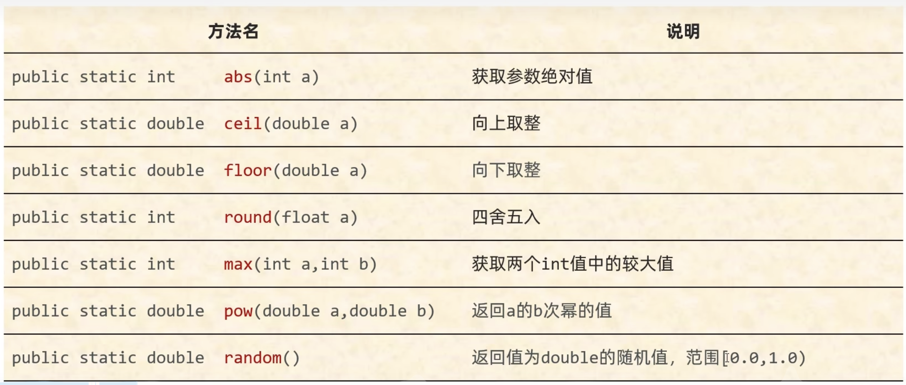
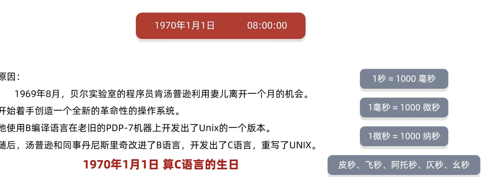
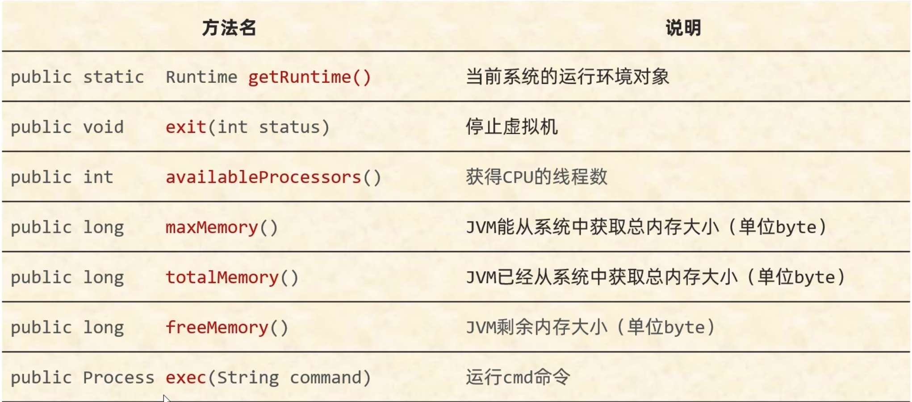
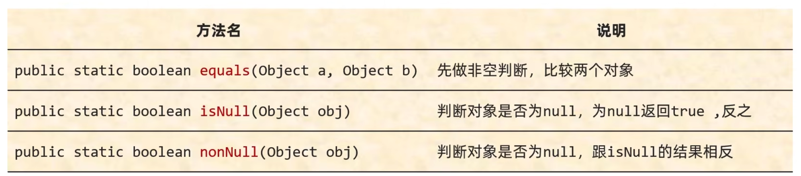
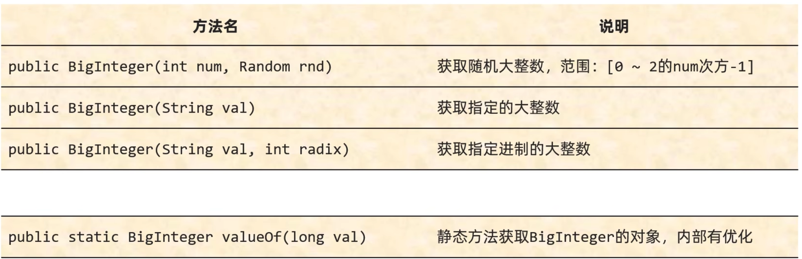
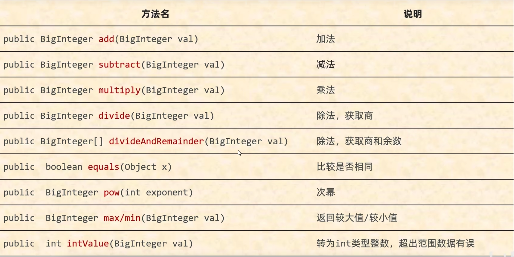
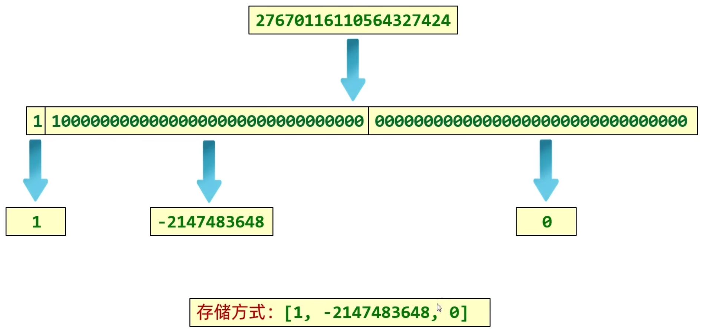
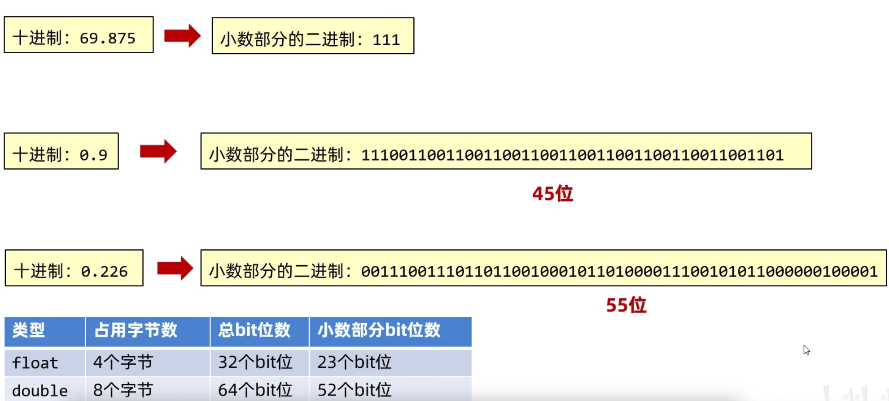
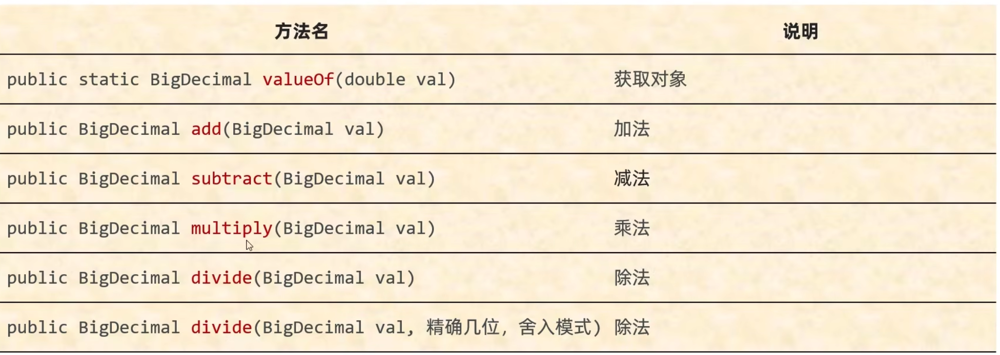

# 常用API

## 1、Math

Math是一个帮助我们用于进行数学计算的工具类，私有化构造方法，所有的方法都是静态的



```java
//abs 获取参数绝对值
System.out.println(Math.abs(88)); //88
System.out.println(Math.abs(-88));//88
//bug:
//以int类型为例，取值范围：-2147483648 ~ 2147483647
//如果没有正数与负数对应，那么传递负数结果有误
//-2147483648 没有正数与之对应，所以abs结果产生bug
System.out.println(Math.abs(-2147483648));//-2147483648
System.out.println(Math.absExact(-2147483648));
```

## 2、System

| 方法名                                                       | 说明                         |
| ------------------------------------------------------------ | ---------------------------- |
| public static void exit(int status)                          | 终止当前运行的 Java 虛拟机   |
| public static long currentTimeMillis ()                      | 返回当前系统的时间毫秒值形式 |
| public static void arraycopy(数据源数组，起始索引，目的地数组，起始索引，拷贝个数） | 数组拷贝                     |




我国在东八区，有八个小时的时差，我们的时间原点是1970:08:00:00;

Eg1:

```java
//方法的形参：状态码：
//0：表示当前虚拟机是正常停止
//非0：表示当前虚拟机异常停止
System.exit(0);
System.out.println("看看我执行了吗？");
//以拼图小游戏为例：
//当我们需要把整个程序就结束的时候，就可以调用这个方法。
```

Eg2:

```java
//拷贝数组
int[] arr1 = {1, 2, 3, 4, 5, 6, 7, 8, 9, 10};
int[] arr2 = new int[10];
// 把arr1数组中的数据拷贝到arr2中
// 参数一：数据源，要拷贝的数据从哪个数组而来
// 参数二：从数据源数组中的第几个索引开始拷贝
// 参数三：目的地，我要把数据拷贝到哪个数组中
// 参数四：目的地数组的索引。
// 参数五：拷贝的个数
System.arraycopy(arr1, 0, arr2, 0, 5);
//验证
for (int i = 0; i < arr2.length; i++) {
    System.out.print(arr2[i] + " ");
}

```

1. 如果数据源数组和目的地数组都是基本数据类型，那么两者的类型必须保持一致，否则会报错

2. 在拷贝的时候需要考虑数组的长度，如果超出范围也会报错

3. 如果数据源数组和目的地数组都是引用数据类型，那么子类类型可以赋值给父类类型

## 3、Runtime



## 4、Object和Objects

Object是Java中的顶级父类，所有的类都直接或间接的继承于Object类。

Object类中的方法可以被所有子类访问，所以我们要学习Object类和其中的方法。

### (1)Object的构造方法

public Object(); 顶级父类中只有无参构造方法

### (2)Object的成员方法

#### toString()

默认情况下，打印一个对象打印的就是地址值，但是地址值对子我们是没什么意义的，如何打印对象内部的属性值？

处理方案：重写父类object类中的tostring方法

```java
//1.toString 返回对象的字符串表示形式
Object obj = new Object();
String str1 = obj.toString();
System.out.println(str1);    //java.lang.Object@2a84aee7

Student stu = new Student();
String str2 = stu.toString();
System.out.println(str2);    //kang.kk.Test.Student@30f39991
//细节：
//System：类名
//out：静态变量
//System.out：获取打印的对象
//println():方法
//参数：表示打印的内容
//核心逻辑：
//当我们打印一个对象的时候，底层会调用对象的toString方法，把对象变成宇符串。
//然后再打印在控制台上，打印完毕换行处理。
System.out.println(stu);      //kang.kk.Test.Student@30f39991
```

#### equals()

```java
// 比较两𠆤对象是否相等
// public boolean equals(Object obj)

Student s1 = new Student("zhangsan", 23);
Student s2 = new Student("zhangsan", 23);
boolean result1 = s1.equals(s2);
System.out.println(result1);
//结论：
// 如果没有重写equa1s方法，那么默认使用object中的方法进行比较，比较的是地址值是否相等
// 一般来讲地址值对于我们意义不大，所以我们会重写，重写之后比较的就是对象内部的属性值了。
```

```java
String s = "abc";
StringBuilder sb = new StringBuilder ("abc");
System.out.println(s.equals (sb));// false
// 因为equals方法是被s调用的，而s是字符串
// 所以equals要看String类中的
// 字符串中的equals方法，先判桥参数是否为字符串
// 如果是字符串，再比较内部的属性
// 但是如果参数不是字符串，直接返回false
System.out .println(sb.equals(s));// false
// 因为equals方法是被sb调用的，而sb是StringBuilder
// 所以这里的equals方法要看stringBui1der中的equals方法
// 那么在StringBuilder当中，没有重写equals方法
// 使用的是object中的
// 在object当中默认是使用==号比较两个对象的地址值
// 而这里的s和sb记录的地址值是不一样的，所以结果返回false
```

#### clone()

把A对象的属性值完全拷贝给B对象，也叫拷贝对象，对象复制

浅克隆：

​	不管对象内部的属性是基本数据类型还是引用数据类型，都完全拷贝过来

深克隆：

​	基本数据类型拷贝过来

​	宇符串复用

​	引用数据类型会重新创建新的

clone()默认浅克隆，如果需要深克隆需要重写方法或者使用第三方工具类

```java
// 调用父类中的clone方法
// 相当于让了ava帮我们克隆一个对象，并把克隆之后的对象返回出去。
// 先把被克隆对象中的数组获取出来
int[] data = this.data;
// 创建新的数组
int [] newData = mew int[data.length];
//拷贝数组中的数据
for (int i =0; i< data.length; i++) {
newData[i] = data[i];
//调用父类中的方法克隆对象
User u = (User) super.clone();
//因为父类中的克隆方法是浅克隆，替换克隆出来对象中的数组地址值
u.data = newData;
return u;
```

### (3)Objects

Objects是一个工具类，提供了一些方法去完成一些功能



#### equals()

```java
public static boolean equals(Object a, Object b) {
    return (a == b) || (a != null && a.equals(b));
}
//细节：
//1.方法的底层会判断a是否为nu11，如果为nu11，直接返回false
//2.如果a不为nu11，那么就利用a再次调用equals方法
//3.此时a是Student类型，所以最终还是会调用student中的equals方法。如果没有重写，比较地址值，如果重写了，就比较属性值。
```

 ## 5、BigInteger

### (1)BigInterger构造方法

在Java中，整数有四种类型：byte, short, int, long，在底层占用字节个数：byte1个字节、short2个字节、int4个字节、long8个字节。

BigInteger对象一旦创建，内部的值不能发生改变



① 如果BigInteger表示的数字没有超出long的范围，可以用静态方法获取。

② 如果BigInteger表示的超出long的范围，可以用构造方法获取。

③ 对象一旦创建，BigInteger内部记录的值不能发生改变。

④ 只要进行计算都会产生一个新的BigInteger对象

```java
// 1. 获取一个随机的大整数
Random r = new Random();
for (int i = 0; i < 100; i++) {
    BigInteger bd1 = new BigInteger(4, r);
    System.out.println(bd1);//[0 ~ 15]
}

// 2.获取一个指定的大整数
	// 细节：字符串中必须是整数，否则会报错
BigInteger bd2 = new BigInteger("1.1");
System.out.println(bd2);
BigInteger bd3 = new BigInteger("abc");
System.out.println(bd3);

// 3.获取指定进制的大整数
	// 细节：字符串中的数字必须是整数,字符串中的数字必须要跟进制吻合,比如二进制中，那么只能写0和1，写其他的就报错。
BigInteger bd4 = new BigInteger("123", 2);
System.out.println(bd4);

// 4.静态方法获取BigInteger的对象，内部有优化
//细节：
	//1.能表示范围比较小，在1ong的取值范围之类，如果超出Long.MAX_VALUE的范围就不行了。
BigInteger bd5 = BigInteger.valueOf(100);
System.out.println(bd5);
	//2.在内部对常用的数宇：-16~ 16 进行了优化。提前把-16~ 16先创建好BigInteger的对象，如果多次获取不会重新创建新的。
BigInteger bd5 = BigInteger.valueOf (16) ;
BigInteger bd6 = BigInteger.valueOf (16);
System.out.println(bd5 == bd6);//true

BigInteger bd7 = BigInteger.valueOf(17);
BigInteger bd8 = BigInteger.valueOf(17);
System.out.printin(bd7 == bd8);//false
```

### (2)BigInterger成员方法



### (3)BigInterger的底层存储原理



## 6、BigDecimal

### (1)计算机中的小数



### (2)BigDecimal的构造方法

```java
// 构造方法获取BigDecimal对象
	public BigDecimal(double val)
	public BigDecimal(String val)
// 静态方法获取BigDecimal对象
public static BigDecimal valueOf (double val)
```

1. 如果要表示的数字不大，没有超出double的取值范围，建议使用静态方法

2. 如果要表示的数字比较大，超出了double的取值范围，建议使用构造方法
3. 如果我们传递的是a~1日之间的整数，包含日，包含1日，那么方法会返回己经创建好的对象，不会重新new

### (3)BigDecimal的成员方法



`BigDecimal res = bd1.divide(bd2,2,RoundingMode.HALF_UP); //保留两位小数，舍入模式采用RoundingMode.HALF_UP即四舍五入`

### (4)BigDecimal的底层存储方法

```Java
//BigDecimal的底层存储原理：存储的是各个字符对应的ASCII码
BigDecimal bd1 = new BigDecimal("0.226");    // [48,46, 50, 50, 54]
BigDecimal bd2 = new BigDecimal("123.226");  // [49, 50, 51, 46, 50, 50, 54]
BigDecimal bd3 = new BigDecimal("-1.5");     // [45, 49, 46, 53]
```
