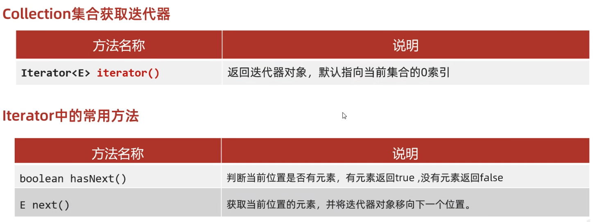

# 常用API

## 1、Math

Math是一个帮助我们用于进行数学计算的工具类，私有化构造方法，所有的方法都是静态的


```java
//abs 获取参数绝对值
System.out.println(Math.abs(88)); //88
System.out.println(Math.abs(-88));//88
//bug:
//以int类型为例，取值范围：-2147483648 ~ 2147483647
//如果没有正数与负数对应，那么传递负数结果有误
//-2147483648 没有正数与之对应，所以abs结果产生bug
System.out.println(Math.abs(-2147483648));//-2147483648
System.out.println(Math.absExact(-2147483648));
```

## 2、System

| 方法名                                                       | 说明                         |
| ------------------------------------------------------------ | ---------------------------- |
| public static void exit(int status)                          | 终止当前运行的 Java 虛拟机   |
| public static long currentTimeMillis ()                      | 返回当前系统的时间毫秒值形式 |
| public static void arraycopy(数据源数组，起始索引，目的地数组，起始索引，拷贝个数） | 数组拷贝                     |


我国在东八区，有八个小时的时差，我们的时间原点是1970:08:00:00;

Eg1:

```java
//方法的形参：状态码：
//0：表示当前虚拟机是正常停止
//非0：表示当前虚拟机异常停止
System.exit(0);
System.out.println("看看我执行了吗？");
//以拼图小游戏为例：
//当我们需要把整个程序就结束的时候，就可以调用这个方法。
```

Eg2:

```java
//拷贝数组
int[] arr1 = {1, 2, 3, 4, 5, 6, 7, 8, 9, 10};
int[] arr2 = new int[10];
// 把arr1数组中的数据拷贝到arr2中
// 参数一：数据源，要拷贝的数据从哪个数组而来
// 参数二：从数据源数组中的第几个索引开始拷贝
// 参数三：目的地，我要把数据拷贝到哪个数组中
// 参数四：目的地数组的索引。
// 参数五：拷贝的个数
System.arraycopy(arr1, 0, arr2, 0, 5);
//验证
for (int i = 0; i < arr2.length; i++) {
    System.out.print(arr2[i] + " ");
}

```

1. 如果数据源数组和目的地数组都是基本数据类型，那么两者的类型必须保持一致，否则会报错

2. 在拷贝的时候需要考虑数组的长度，如果超出范围也会报错

3. 如果数据源数组和目的地数组都是引用数据类型，那么子类类型可以赋值给父类类型

## 3、Runtime


## 4、Object和Objects

Object是Java中的顶级父类，所有的类都直接或间接的继承于Object类。

Object类中的方法可以被所有子类访问，所以我们要学习Object类和其中的方法。

### (1)Object的构造方法

public Object(); 顶级父类中只有无参构造方法

### (2)Object的成员方法

#### toString()

默认情况下，打印一个对象打印的就是地址值，但是地址值对子我们是没什么意义的，如何打印对象内部的属性值？

处理方案：重写父类object类中的tostring方法

```java
//1.toString 返回对象的字符串表示形式
Object obj = new Object();
String str1 = obj.toString();
System.out.println(str1);    //java.lang.Object@2a84aee7

Student stu = new Student();
String str2 = stu.toString();
System.out.println(str2);    //kang.kk.Test.Student@30f39991
//细节：
//System：类名
//out：静态变量
//System.out：获取打印的对象
//println():方法
//参数：表示打印的内容
//核心逻辑：
//当我们打印一个对象的时候，底层会调用对象的toString方法，把对象变成宇符串。
//然后再打印在控制台上，打印完毕换行处理。
System.out.println(stu);      //kang.kk.Test.Student@30f39991
```

#### equals()

```java
// 比较两𠆤对象是否相等
// public boolean equals(Object obj)

Student s1 = new Student("zhangsan", 23);
Student s2 = new Student("zhangsan", 23);
boolean result1 = s1.equals(s2);
System.out.println(result1);
//结论：
// 如果没有重写equa1s方法，那么默认使用object中的方法进行比较，比较的是地址值是否相等
// 一般来讲地址值对于我们意义不大，所以我们会重写，重写之后比较的就是对象内部的属性值了。
```

```java
String s = "abc";
StringBuilder sb = new StringBuilder ("abc");
System.out.println(s.equals (sb));// false
// 因为equals方法是被s调用的，而s是字符串
// 所以equals要看String类中的
// 字符串中的equals方法，先判桥参数是否为字符串
// 如果是字符串，再比较内部的属性
// 但是如果参数不是字符串，直接返回false
System.out .println(sb.equals(s));// false
// 因为equals方法是被sb调用的，而sb是StringBuilder
// 所以这里的equals方法要看stringBui1der中的equals方法
// 那么在StringBuilder当中，没有重写equals方法
// 使用的是object中的
// 在object当中默认是使用==号比较两个对象的地址值
// 而这里的s和sb记录的地址值是不一样的，所以结果返回false
```

#### clone()

把A对象的属性值完全拷贝给B对象，也叫拷贝对象，对象复制

浅克隆：

​	不管对象内部的属性是基本数据类型还是引用数据类型，都完全拷贝过来

深克隆：

​	基本数据类型拷贝过来

​	宇符串复用

​	引用数据类型会重新创建新的

clone()默认浅克隆，如果需要深克隆需要**重写方法**或者**使用第三方工具类**

```java
// 调用父类中的clone方法
// 相当于让了ava帮我们克隆一个对象，并把克隆之后的对象返回出去。
// 先把被克隆对象中的数组获取出来
int[] data = this.data;
// 创建新的数组
int [] newData = mew int[data.length];
//拷贝数组中的数据
for (int i =0; i< data.length; i++) {
newData[i] = data[i];
//调用父类中的方法克隆对象
User u = (User) super.clone();
//因为父类中的克隆方法是浅克隆，替换克隆出来对象中的数组地址值
u.data = newData;
return u;
```

### (3)Objects

Objects是一个工具类，提供了一些方法去完成一些功能


#### equals()

```java
public static boolean equals(Object a, Object b) {
    return (a == b) || (a != null && a.equals(b));
}
//细节：
//1.方法的底层会判断a是否为nu11，如果为nu11，直接返回false
//2.如果a不为nu11，那么就利用a再次调用equals方法
//3.此时a是Student类型，所以最终还是会调用student中的equals方法。如果没有重写，比较地址值，如果重写了，就比较属性值。
```

 ## 5、BigInteger

### (1)BigInterger构造方法

在Java中，整数有四种类型：byte, short, int, long，在底层占用字节个数：byte1个字节、short2个字节、int4个字节、long8个字节。

BigInteger对象一旦创建，内部的值不能发生改变


① 如果BigInteger表示的数字没有超出long的范围，可以用静态方法获取。

② 如果BigInteger表示的超出long的范围，可以用构造方法获取。

③ 对象一旦创建，BigInteger内部记录的值不能发生改变。

④ 只要进行计算都会产生一个新的BigInteger对象

```java
// 1. 获取一个随机的大整数
Random r = new Random();
for (int i = 0; i < 100; i++) {
    BigInteger bd1 = new BigInteger(4, r);
    System.out.println(bd1);//[0 ~ 15]
}

// 2.获取一个指定的大整数
	// 细节：字符串中必须是整数，否则会报错
BigInteger bd2 = new BigInteger("1.1");
System.out.println(bd2);
BigInteger bd3 = new BigInteger("abc");
System.out.println(bd3);

// 3.获取指定进制的大整数
	// 细节：字符串中的数字必须是整数,字符串中的数字必须要跟进制吻合,比如二进制中，那么只能写0和1，写其他的就报错。
BigInteger bd4 = new BigInteger("123", 2);
System.out.println(bd4);

// 4.静态方法获取BigInteger的对象，内部有优化
//细节：
	//1.能表示范围比较小，在1ong的取值范围之类，如果超出Long.MAX_VALUE的范围就不行了。
BigInteger bd5 = BigInteger.valueOf(100);
System.out.println(bd5);
	//2.在内部对常用的数宇：-16~ 16 进行了优化。提前把-16~ 16先创建好BigInteger的对象，如果多次获取不会重新创建新的。
BigInteger bd5 = BigInteger.valueOf (16) ;
BigInteger bd6 = BigInteger.valueOf (16);
System.out.println(bd5 == bd6);//true

BigInteger bd7 = BigInteger.valueOf(17);
BigInteger bd8 = BigInteger.valueOf(17);
System.out.printin(bd7 == bd8);//false
```

### (2)BigInterger成员方法


### (3)BigInterger的底层存储原理


## 6、BigDecimal

### (1)计算机中的小数


### (2)BigDecimal的构造方法

```java
// 构造方法获取BigDecimal对象
	public BigDecimal(double val)
	public BigDecimal(String val)
// 静态方法获取BigDecimal对象
public static BigDecimal valueOf (double val)
```

1. 如果要表示的数字不大，没有超出double的取值范围，建议使用静态方法

2. 如果要表示的数字比较大，超出了double的取值范围，建议使用构造方法
3. 如果我们传递的是a~1日之间的整数，包含日，包含1日，那么方法会返回己经创建好的对象，不会重新new

### (3)BigDecimal的成员方法


`BigDecimal res = bd1.divide(bd2,2,RoundingMode.HALF_UP); //保留两位小数，舍入模式采用RoundingMode.HALF_UP即四舍五入`

### (4)BigDecimal的底层存储方法

```Java
//BigDecimal的底层存储原理：存储的是各个字符对应的ASCII码
BigDecimal bd1 = new BigDecimal("0.226");    // [48,46, 50, 50, 54]
BigDecimal bd2 = new BigDecimal("123.226");  // [49, 50, 51, 46, 50, 50, 54]
BigDecimal bd3 = new BigDecimal("-1.5");     // [45, 49, 46, 53]
```

# 正则表达式

这里省略了很多东西，等有需要的时候重新学习

作用：检查字符串是否满足规则，在一段文本中查找满足要求的内容

API帮助文档Pattern


```java
// 如果写成了一个&，那么此时&表示就不是交集了，而是一个简简单单的&符号
System.out.println("d".matches("[a-z&&[def]]"));
System.out.println("d".matches("[a-z&[def]]"));
// \表示转义字符
System.out.println("2".matches("\\d"));

//必须是数字字母下划线至少6位
System.out.println("2442ffsf".matches("\\w{6,}"));//true
System.out.println("244f".matches( "\\w{6,}"));//false
//必须是数字和字符 必须是4位
System.out.println("23dF".matches("[a-zA-Z0-9]{4}"));//true
System.out.println("23_F".matches("[a-zA-Z0-9]{4}"));//false
System.out.println("23dF".matches("[\\w&&[^_]]{4}"));//true
System.out.println("23_F".matches("[\\w&&[^_]]{4}"));//false
```

# 时间相关类

## 1、JDK7以前时间相关类

​	全世界的时间，有一个统一的计算标准，格林尼治时间 /格林威治时间 (Greenwich Mean Time）简称 GMT，其计算核心是地球自转一天是24小时，太阳直射时为正午12点，但误差太大，目前世界标准时间 (UTC）已经替为：原子钟。中国位于东八区，时间标准时间+8小时

### (1)Date

Date 类是一个JDK写好的Javabean类，用来描述时间，精确到毫秒。利用空参构造创建的对象，默认表示系统当前时间，利用有参构造创建的对象，表示指定的时间。

```java
/* 
public Date()                    创建Date对象，表示当前时间
public Date (1ong date)          创建Date对象，表示指定时间
public void setTime (long time)  设置/修改毫秒值
public long getTime ()           获取时间对象的毫秒值
*/
// 1.创建对象表示一个时间
Date d1 = new Date();
System.out.println(d1);         // Thu Jul 11 15:42:04 CST 2024
// 2.创建对象表示一个指定的时间
Date d2 = new Date(0L);
System.out.println(d2);         // Thu Jan 01 08:00:00 CST 1970
// 3.setTime 修改时间
// 1000毫秒=1秒
d2.setTime(1000L);
System.out.println(d2);         // Thu Jan 01 08:00:01 CST 1970
// 4.getTime获取当前时间的毫秒值
long time = d2.getTime();     
System.out.println(time);       // 1000
```

### (2)SimpleDateFormat

SimpleDateFormat 是一个以与语言环境有关的方式来格式化和解析日期的具体类。它允许进行格式化（日期 -> 文本）、解析（文本 -> 日期）和规范化。

|                 构造方法                 |                   说明                   |
| :--------------------------------------: | :--------------------------------------: |
|       public SimpleDateFormat ( )        |  构造一个SimpleDateFormat，使用默认格式  |
| public SimpleDateFormat (String pattern) | 构造一个simpleDateFormat，使用指定的格式 |

|                常用方法                |            说明             |
| :------------------------------------: | :-------------------------: |
| public final String format (Date date) | 格式化（日期对象-，字符串） |
|    public Date parse(String source)    |  解析（字符串 ->日期对象）  |

#### 格式化：把时间变成我们喜欢的格式


```java
// 1.利用空参构造创建SimpleDateFormat对象，默认格式
SimpleDateFormat sdf1 = new SimpleDateFormat();
Date d1 = new Date(0L);
String str1 = sdf1.format(d1);
System.out.println(str1);

//2. 利用带参构造创建SimpleDateFormat对象，指定格式
SimpleDateFormat sdf2 = new SimpleDateFormat("yyyy-MM-dd HH:mm:ss");
String str2 = sdf2.format(d1);
System.out.println(str2);

//课堂练习：yyyy年MM月dd日 时：分：秒 星期E
SimpleDateFormat sdf3 = new SimpleDateFormat("yyyy-MM-dd HH:mm:ss EE");
String str3 = sdf3.format(d1);
System.out.println(str3);
```

#### 解析：把宇符串表示的时间变成Date对象

```java
// 1.定义一个字符串表示时间
String str1 = "2023-11-11 11-11-11";
// 2.利用带参构造创建SimpleDateFormat对象，创建对象的格式要跟字符串的格式完全一样
SimpleDateFormat sdf = new SimpleDateFormat("yyyy-MM-dd HH-mm-ss");
Date date = sdf.parse(str1);
System.out.println(date.getTime());
```

```java
// "yyyy年MM月dd日 HH:mm:ss"可以解析"2023年11月11日 0:01:00"，会format成“2023年11月11日 00:01:00”
SimpleDateFormat sdf1 = new SimpleDateFormat("yyyy年MM月dd日 HH:mm:ss");
String str1 = "2023年11月11日 0:01:00";
Date date1 = sdf1.parse(str1);
String str2 = sdf1.format(date1);
System.out.println(str2);         // 2023年11月11日 00:01:00
```

### (3)Calendar

calendar代表了系统当前时间的日历对象，可以单独修改、获取时间中的年，月，日，Calendar是一个抽象类，不能直接创建对象。

|                   方法名                   |             说明             |
| :----------------------------------------: | :--------------------------: |
|    public static calendar getInstance()    |    获取当前时间的日历对象    |
|        public final Date getTime()         |         获取日期对象         |
|      public final setTime (Date date)      |      给日历设置日期对象      |
|       public long getTimeInMillis ()       |        拿到时间毫秒值        |
| public void setTimeInMillis (long millis） |     给日历设置时间毫秒值     |
|         public int get(int field)          |    职日历中的某个字段信息    |
|   public void set(int field, int value)    |    修改日历的某个字段信息    |
|   public void add(int field, int amount)   | 为某个字段增加/ 减少指定的值 |

**细节1**：calendar是一个抽象类，不能直接new，而是通过一个静态方法获取到子类对象底层原理:会根据系统的不同时区米获取不同的日历对象,默认表示当前时间。把会把时间中的纪元，年，月，日，时，分，秒，星期，等等的都放到一个数组当中

0：纪元 Calendar.ERA

1：年 Calendar.YEAR

2：月 Calendar.MONTH

3：一年中的第几周 Calendar.WEEK_OF_YEAR

4：一个月中的第几周 Calendar.WEEK_OF_MONTH

5：一个月中的第几天 Calender.DATE/Calender.DAY_OF_MONTH

······

**细节2**：月份：范围0~11 如果获取出来的是0.那么实际上是1月，星期：在老外的服里，星期日是一周中的第一天 1（星期日）2（星期一） 3（星期二）4（星期三）5（星期四）6（星期五） 7（星期六）

```java
// 1. 获取日历对象
Calendar c = Calendar.getInstance();

// 2.修改日历代表的时间
Date d = new Date(0L);
c.setTime(d);
System.out.println(c);

// 3.获取日期中某个字段的信息
int year = c.get(1);
int month = c.get(2);
int day = c.get(5);
System.out.println(year + "," + month + "," + day);

// 4.修改日历中某个字段的值
c.set(Calendar.YEAR, 2000);
c.set(Calendar.MONTH, 999);   //2083,3,18,会自动的进行转换

// 5.为某个字段增加/减少指定的值
c.add(Calendar.MONTH, -1);


```

## 2、JDK7以后时间相关类

**ps：没好好学、等用到的时候重新看**

代码层面：降低代码的复杂度

安全层面：JDK7：会导致多线程环境下的数据安全问题

​		   JDK8：时间日期对象都是不可变的，解决了上述问题

新增的时间相关类：

​	ZoneId： 时区

​	Instant：时间戳

​	ZoneDateTime：带时区的时间

​	DateTimeFormatter：用于时间的格式化和解析

​	LocalDate：年、月、日

​	LocalTime：时、分、秒

​	LocalDateTime：年、月、日、时、分、秒

​	Duration:时问问隔（秒，纳秒）

​	Period:时问问隔（年，月，日）

​	ChronoUnit：时间间隔（所有单位）


### (1)ZoneId时区

| 方法名                                      | 说明                     |
| ------------------------------------------- | ------------------------ |
| static Set  \<string> getAvailablezoneIds() | 获取Java中支持的所有时区 |
| static ZoneId systemDefault ()              | 获取系统默认时区         |
| static ZoneId of(String zoneId)             | 获取一个指定时区         |

### (2)Instant时间戳


### (3)ZoneDateTime


### (4)DateTimeFormater用于时间格式化和解析


### (5)LocalDate、LocalTime、LocalDateTime


### (6)Duration、Period、ChronoUnit

|   方法名   |                 说明                 |
| :--------: | :----------------------------------: |
|  Duration  |  用于计算两个“时间”间隔（秒，纳秒）  |
|   Period   | 用于计算两个“日期”间隔（年、月、日） |
| ChronoUnit |        用于计算两个“日期”间隔        |

# 包装类

包装类：用一个对象，把基本数据类型给包起来, 即基本数据类型对应的对象

| 基本数据类型 | 引用数据类型 |
| :----------: | :----------: |
|     byte     |     Byte     |
|    short     |    Short     |
|     char     |  Character   |
|     int      |   Integer    |
|     long     |     Long     |
|    float     |    Float     |
|    double    |    Double    |

## 1、JDK5以前获取Integer对象的方式（了解）

```java
/*
    public Integer(int value) 根据传递的整数创建一个Integer对象
    public Integer(String s) 根据传递的字符串创建一个Integer对象
    public static Integer valueOf(int i) 根据传递的整数创建一个Integer对象
    public static Integer valueof(String s) 根据传递的字符串创建一个Integer对象
    public static Integer valueof(String s, int radix) 根据传递的字符串和进制创建一个Integer对象
*/

//1.利用构造方法获取Integer的对象(JDK5以前的方式)
Integer i1 = new Integer(1);
Integer i2 = new Integer("1");
System.out.println(i1);
System.out.println(i2);

//2.利用静态方法获取Integer的对象(JDK5以前的方式)
Integer i3 = Integer.valueOf(123);
Integer i4 = Integer.valueOf("123");
Integer i5 = Integer.valueOf("123", 8);

System.out.println(i3);
System.out.println(i4);
System.out.println(i5);

//3.这两种方式获取对象的区别(掌握)
//底层原理：
//因为在实际开发中，-128~127之间的数据，用的比较多。
//如果每次使用都是new对象，那么太浪费内存了
//所以，提前把这个范围之内的每一个数据都创建好对象
//如果要用到了不会创建新的，而是返回已经创建好的对象。
Integer i6 = Integer.valueOf(127);
Integer i7 = Integer.valueOf(127);
System.out.println(i6 == i7);//true

Integer i8 = Integer.valueOf(128);
Integer i9 = Integer.valueOf(128);
System.out.println(i8 == i9);//false

//因为看到了new关键字，在Java中，每一次new都是创建了一个新的对象
//所以下面的两个对象都是new出来，地址值不一样。
Integer i10 = new Integer(127);
Integer i11 = new Integer(127);
System.out.println(i10 == i11);//false

Integer i12 = new Integer(128);
Integer i13 = new Integer(128);
System.out.println(i12 == i13);//false
```

## 2、JDK5以前包装类如何进行计算

```java
//在以前包装类如何进行计算
 Integer i1 = new Integer(1);
 Integer i2 = new Integer(2);*/

 //需求:要把两个数据进行相加得到结果3
 //对象之间是不能直接进行计算的。
 //步骤:
 //1.把对象进行拆箱，变成基本数据类型
 //2.相加
 //3.把得到的结果再次进行装箱(再变回包装类)

 int result = i1.intValue() + i2.intValue();
 Integer i3 = new Integer(result);
 System.out.println(i3);
```

## 3、自动装箱和拆箱

```java
//在JDK5的时候提出了一个机制:自动装箱和自动拆箱
//自动装箱:把基本数据类型会自动的变成其对应的包装类
//自动拆箱:把包装类自动的变成其对象的基本数据类型

//在底层，此时还会去自动调用静态方法valueof得到一个Integer对象，只不过这个动作不需要我们自己去操作了
//自动装箱的动作
Integer i1 = 10;


Integer i2 = new Integer(10);
//自动拆箱的动作
int i = i2;

//结论：在JDK5以后，int和Integer可以看做是同一个东西，因为在内部可以自动转化。
```

## 4、Integer成员方法


```java 
/*
    public static string tobinarystring(int i) 得到二进制
    public static string tooctalstring(int i) 得到八进制
    public static string toHexstring(int i) 得到十六进制
    public static int parseInt(string s) 将字符串类型的整数转成int类型的整数
*/

//1.把整数转成二进制，十六进制
String str1 = Integer.toBinaryString(100);
System.out.println(str1);//1100100

//2.把整数转成八进制
String str2 = Integer.toOctalString(100);
System.out.println(str2);//144

//3.把整数转成十六进制
String str3 = Integer.toHexString(100);
System.out.println(str3);//64

//4.将字符串类型的整数转成int类型的整数
//强类型语言:每种数据在java中都有各自的数据类型
//在计算的时候，如果不是同一种数据类型，是无法直接计算的。
int i = Integer.parseInt("123");
System.out.println(i);
System.out.println(i + 1);//124
//细节1:
//在类型转换的时候，括号中的参数只能是数字不能是其他，否则代码会报错
//细节2:
//8种包装类当中，除了Character都有对应的parseXxx的方法，进行类型转换
String str = "true";
boolean b = Boolean.parseBoolean(str);
System.out.println(b);
```


# 常见算法

## 1、查找算法

### (1)基本查找

```java
public static ArrayList<Integer> basicSerrch(int arr[],int number){
    ArrayList<Integer> list = new ArrayList<>();
    for(int i=0;i<arr.length;i++){
        if(arr[i]==number){
            list.add(arr[i]);
        }
    }
    return list;
}
```

### (2)二分查找、插值查找、斐波那契额查找

二分查找、插值查找、斐波那契额查找各自的特点

相同点：都是通过不断的缩小范国来查找对应的数据的

不同点：计算mid的方式不一样

二分查找：mid每次都是指向范围的中间位置

插值查找：mid尽可能的靠近要查找的数据，但是要求数据尽可能的分布均匀

斐波那契额查找：根据黄金分割点来计算mid指向的位置

### (3)分块查找

块内无序、块间有序

## 2、排序算法

### (1)冒泡排序

### (2)选择排序

### (3)插入排序

### (4)快速排序

## 3、递归算法

递归一定要有出口,否则会出现内存溢出

## 4、Arrays

操作数组的工具类


 实现数组的反向排列: 重写Comparator接口

```java
Integer[] arr = {1, 2, 3, 4, 5, 6, 7, 8, 9, 10};
Arrays.sort(arr, new Comparator<Integer>() {
    @Override
    public int compare(Integer o1, Integer o2) {
        return o2 - o1;
    }
});
System.out.println(Arrays.toString(arr));
```

# lambda表达式

## 1、函数式编程

函数式编程 (Functional programming）是一种思想特点。函数式编程思想，忽略面向对象的复杂语法，强调做什么，而不是谁去做, Lambda表达式就是函数式思想的体现。

## 2、Lambda表达式的标准格式

Lambda表达式是JDK8开始后的一种新语法格式

```java
()->{
  
  
}
//  (): 对应着方法的形参

//	->: 固定格式

//	{}: 对应着方法的方法体
```

```java
// 匿名内部类
Arrays.sort(arr, new Comparator<Integer>() {
    @Override
    public int compare(Integer o1, Integer o2) {
        return o2 - o1;
    }
});
System.out.println(Arrays.toString(arr));

//Lambda表达式的标准格式
Arrays.sort(arr, (Integer o1, Integer o2) -> {
            return o1 - o2;
        }
);
System.out.println(Arrays.toString(arr));

//Lambda表达式的省略写法
Arrays.sort(arr, (o1, o2) -> o1 - o2);
```

**注意点**

Lambda表达式可以用来简化匿名内部类的书写

Lambda表达式只能简化函数式接口的匿名内部类的写法

函数式接口：**有且仅有一个抽象方法**的接口叫做函数式接口，接口上方可以加@Functionalinterface注解


## 3、Lambda表达式的省略写法

lambda的省略规则：

1. 参数类型可以省略不写。

2. 如果只有一个参数，参数类型可以省略，同时()也可以省路。

3. 如果Lambda表达式的方法体只有一行，大括号，分号，return可以省略不写，需要同时省略。

```java
//Lambda表达式的省略写法
Arrays.sort(arr, (o1, o2) -> o1 - o2);
```

eg: 将字符串按照长短顺序排列起来:

```java
String[] arr = {"a", "aaa", "aa", "aaaa"};

//1.使用匿名内部类的方法
Arrays.sort(arr, new Comparator<String>() {
    @Override
    public int compare(String o1, String o2) {
        return o1.length() - o2.length();
    }
});

//2.Lambda完整格式
Arrays.sort(arr, (String o1, String o2)-> {
        return o1.length() - o2.length();
});

//3.Lambda省略格式
Arrays.sort(arr, (o1, o2)-> o1.length() - o2.length());
```

# 集合进阶-List系列

## 1、集合体系结构

Collection单列结合

Map双列集合


其中, 红色边框是接口, 蓝色边框是实现类

## 2、Collection

### (1)Collection成员方法


```java
/*
public boolean add(E e)             添加
public void clear()                 清空
public boolean remove(E e)          删除
public boolean contains(Object obj) 判断是否包含
public boolean isEmpty()            判断是否为空
public int size()                   集合长度   
*/

//注意点：Collection是一个接口,我们不能直接创建他的对象。所以，为了学习Collection接口里面的方法，只能创建他实现类的对象。 实现类：ArrayList

Collection<String> coll = new ArrayList<>();


//1.添加元素
//细节1：如果我们要往List系列集合中添加数据，那么方法永远返回true，因为List系列的是允许元素重复的。
//细节2：如果我们要往Set系列集合中添加数据，如果当前要添加元素不存在，方法返回true，表示添加成功。
//                                       如果当前要添加的元素已经存在，方法返回false，表示添加失败。
//                                       因为Set系列的集合不允许重复。
coll.add("aaa");
coll.add("bbb");
coll.add("ccc");
System.out.println(coll);

//2.清空
coll.clear();

//3.删除
//细节1：因为Collection里面定义的是共性的方法，所以此时不能通过索引进行删除。只能通过元素的对象进行删除。
//细节2：方法会有一个布尔类型的返回值，删除成功返回true，删除失败返回false如果要删除的元素不存在，就会删除失败。
System.out.println(coll.remove("aaa"));
System.out.println(coll);

//4.判断元素是否包含
//细节：底层是依赖equals方法进行判断是否存在的如果集合中存储的是自定义对象，也想通过contains方法来判断是否包含，那么在javabean类中，一定要重写equals方法。
boolean result1 = coll.contains("bbb");
System.out.println(result1);

//5.判断集合是否为空
boolean result2 = coll.isEmpty();
System.out.println(result2);//false

//6.获取集合的长度
coll.add("ddd");
int size = coll.size();
System.out.println(size);
```

重写equals方法

```java
@Override
private String name;
private int age;

//快捷键command+n
public boolean equals(Object o) {
    if (this == o) return true;
    if (o == null || getClass() != o.getClass()) return false;
    Student student = (Student) o;
    return age == student.age && Objects.equals(name, student.name);
}
```

### (2)迭代器遍历

迭代器在java中的类是Iterator, 迭代器是集合专用的遍历方式, 迭代器遍历不依赖索引



```java
//1.创建集合并添加元素
Collection<String> coll = new ArrayList<>();
coll.add("aaa");
coll.add("bbb");
coll.add("ccc");
coll.add("ddd");

//2.获取迭代器对象
//迭代器就好比是一个箭头，默认指向集合的0索引处
Iterator<String> it = coll.iterator();
//3.利用循环不断的去获取集合中的每一个元素
while(it.hasNext()){
    //4.next方法的两件事情：获取元素并移动指针
    System.out.println(it.next());
}
```

**注意点：**

​	报错NoSuchElementException

​	迭代器遍历完毕，指针不会复位

​	循环中只能用一次next方法

​	迭代器遍历时，不能用集合的方法进行增加或者删除, 

​		暂时当做一个结论先行记忆，会学习源码详细的再进行分析。

​		如果实在要删除：那么可以用迭代器提供的it.remove()方法进行删除。

​		如果要添加，暂时没有办法。

### (3)增强for遍历


修改增强for中的变量,  不会改变集合中原本的数据

### (4)Lambda表达式遍历

```java
//1.创建集合并添加元素
Collection<String> coll = new ArrayList<>();
coll.add("zhangsan");
coll.add("lisi");
coll.add("wangwu");
//2.利用匿名内部类的形式
	//底层原理：其实也会自己遍历集合，依次得到每一个元素把得到的每一个元素，传递给下面的accept方法
  //s依次表示集合中的每一个数据
coll.forEach(new Consumer<String>() {
   @Override
   public void accept(String s) {
       System.out.println(s);
 	}	
 });
 //lambda表达式
 coll.forEach(s -> System.out.println(s));
```

### (5)总结

1. collection是单列集合的顶层接口，所有方法被List和Set系列集合共享

2. 常见成员方法：

​	add、clear、 remove、 contains、 isEmpty、 size

3. 三种通用的遍历方式：

​	迭代器：在遍历的过程中需要删除元素，需使用迭代器。

​	增强for、Lambda:仅仅想遍历，那么使用增强for或Lambda表达式。

## 3、List

### (1)List特点与特有方法

有序：存和取的元素顺序一致

有索引：可以通过索引操作元素

可重复：存储的元素可以重复


#### List系列中集合的两个删除方法

```java
//List系列集合中的两个删除的方法
	//1.直接删除元素
	//2.通过索引进行删除

//1.创建集合并添加元素
List<Integer> list = new ArrayList<>();
list.add(1);
list.add(2);
list.add(3);

//2.删除元素
//此时删除的是1这个元素，还是1索引上的元素？
//在调用方法的时候，如果方法出现了重载现象
//优先调用，实参跟形参类型一致的那个方法。
list.remove(1); //传入的1默认是int类型, 跟利用索引删除的数据类型一致
System.out.println(list);

//手动装箱，手动把基本数据类型的1，变成Integer类型
Integer i = Integer.valueOf(1);
list.remove(i);

System.out.println(list);
```

### (2)List的五种遍历方式

```java
/*
  List系列集合的五种遍历方式：
      1.迭代器
      2.列表迭代器
      3.增强for
      4.Lambda表达式
      5.普通for循环
*/
        
//创建集合并添加元素
  List<String> list = new ArrayList<>();
  list.add("aaa");
  list.add("bbb");
  list.add("ccc");

 //1.迭代器
  Iterator<String> it = list.iterator();
  while(it.hasNext()){
      String str = it.next();
      System.out.println(str);
  }

//2.增强for
//下面的变量s，其实就是一个第三方的变量而已,在循环的过程中，依次表示集合中的每一个元素
for (String s : list) {
    System.out.println(s);
}

//3.Lambda表达式
//forEach方法的底层其实就是一个循环遍历，依次得到集合中的每一个元素, 并把每一个元素传递给下面的accept方法accept方法的形参s，依次表示集合中的每一个元素
list.forEach(s->System.out.println(s) );


//4.普通for循环
//size方法跟get方法还有循环结合的方式，利用索引获取到集合中的每一个元素
for (int i = 0; i < list.size(); i++) {
    //i:依次表示集合中的每一个索引
    String s = list.get(i);
    System.out.println(s);
}

// 5.列表迭代器
//获取一个列表迭代器的对象，里面的指针默认也是指向0索引的
//额外添加了一个方法：在遍历的过程中，可以添加元素
ListIterator<String> it = list.listIterator();
while(it.hasNext()){
    String str = it.next();
    if("bbb".equals(str)){
        //qqq
        it.add("qqq");
    }
}
System.out.println(list);
```


## 4、ArrayList

**ArrayList集合底层原理**

​	① 利用空参创建的集合，在底层创建一个默认长度为0的数组

​	② 添加第一个元素时，底层会创建一个新的长度为10的数组

​	③ 存满时，会扩容1.5倍

​	④ 如果一次添加多个元素，1.5倍还放不下，则新创建数组的长度以实际为准

## 5、LinkList集合


# 范型

## 1、基本概念

泛型：是JDK5中引入的特性，可以在编译阶段约束操作的数据类型，并进行检查。

泛型的格式：<数据类型＞

注意：泛型只能支持引用数据类型。

好处:

​	(1) 统一数据类型。

​	(2)把运行时期的问题提前到了编译期间，避免了强制类型转换可能出现的异常，因为在编译阶段类型就能确定下来。

范型的细节: 

​	(1)泛型中不能写基本数据类型,

​	(2)指定泛型的具体类型后，传递数据时，可以传入该类类型或者其子类类型

​	(3)如果不写泛型，类型默认是Object

如果我们没有给集合指定类型`ArrayList arrayList = new ArrayList();`，默认认为所有的数据类型都是Object类型此时可以往集合添加任意的数据类型。带来一个坏处：我们在获取数据的时候，无法使用他的特有行为。此时推出了泛型，可以在添加数据的时候就把类型进行统一。而且在获取数据的时候，也省的强转了，非常的方便。

## 2、范型类


```java
//当在编写一个类的时候，如果不确定类型，那么这个类就可以定义为泛型类。
//E : 表示是不确定的类型。该类型在类名后面已经定义过了。
//e：形参的名字，变量名
public class MyArrayList<E> {
    Object[] obj = new Object[10];
    int size;
     
    public boolean add(E e){
        obj[size] = e;
        size++;
        return true;
    }

    public E get(int index){
        return (E)obj[index];
    }

    @Override
    public String toString() {
        return Arrays.toString(obj);
    }
}

MyArrayList<String> myArrayList = new MyArrayList<>();
myArrayList.add("aaaa");
System.out.println(myArrayList.get(0));
System.out.println(myArrayList);
```

## 3、范型方法

当方法中的形参类型不确定时:

​	方法一: 使用类名后面定义的范型		所有方法都能用

​	方法二: 在方法申明上定义自己的范型	只有本方法能用


```java
public class ListUtil {
    //私有化成员方法, ListUtil是一个工具类
    private ListUtil(){}
    //类中定义一个静态方法addAll，用来添加多个集合的元素。

    //参数一：集合
    //参数二: 最后要添加的元素

    public static<E> void addAll(ArrayList<E> list, E e1,E e2,E e3,E e4){
        list.add(e1);
        list.add(e2);
        list.add(e3);
        list.add(e4);
    }

    public static<E> void addAll2(ArrayList<E> list, E...e){
        for (E element : e) {
            list.add(element);
        }
    }
}

ArrayList<String> list1 = new ArrayList<>();
ListUtil.addAll1(list1,"aaa","bbb","ccc");
ListUtil.addAll2(list1,"aaa","bbb","ccc");
```

## 4、范型接口


## 5、范型的继承

范型不具备继承性, 但数据具备继承性

```java
class Ye {}
class Fu extends Ye {}
class Zi extends Fu {}
class Student{}

public class Test04 {
		public static void main(String[] args) {
    		//定义一个方法，形参是一个集合，但是集合中的数据类型不确定。      
        //创建集合的对象
        ArrayList<Ye> list1 = new ArrayList<>();
        ArrayList<Fu> list2 = new ArrayList<>();
        ArrayList<Zi> list3 = new ArrayList<>();
        ArrayList<Student> list4 = new ArrayList<>();

        method(list1);//不会报错
        method(list2);//报错
        method(list3);//报错
        method(list4);//报错
        
        list1.add(new Ye());//不会报错
        list1.add(new Fu());//不会报错
        list1.add(new Zi());//不会报错
        list1.add(Student student) //报错
    }
  
  	//此时，泛型里面写的是什么类型，那么只能传递什么类型的数据。
		public static void method(ArrayList<Ye> list) {}
}
```

## 6、通配符

**应用场景：**

​	1.如果我们在定义类、方法、接口的时候，如果类型不确定，就可以定义泛型类、泛型方法、泛型接口。

​	2.如果类型不确定，但是能知道以后只能传递某个继承体系中的，就可以泛型的通配符

**泛型的通配符：**

​	关键点：可以限定类型的范围。

```java
class Ye {}
class Fu extends Ye {}
class Zi extends Fu {}
class Student{}

public class Test04 {
    public static void main(String[] args) {
        //定义一个方法，形参是一个集合，但是集合中的数据类型不确定。      
        //创建集合的对象
        ArrayList<Ye> list1 = new ArrayList<>();
        ArrayList<Fu> list2 = new ArrayList<>();
        ArrayList<Zi> list3 = new ArrayList<>();
        ArrayList<Student> list4 = new ArrayList<>();

        method(list1);//1
        method(list2);//2
        method(list3);//3
        method(list4);//4        
    }

    //此时，泛型里面写的是什么类型，那么只能传递什么类型的数据, 2、3、4会报错
    public static void method(ArrayList<Ye> list) {}

    //此时, 利用泛型方法有一个小弊端，此时method方法可以接受任意的数据类型, 包括Ye、Fu、Zi、Student, 1234表达式都不会报错
    public static<E> void method(ArrayList<E> list) {}

    //希望：本方法虽然不确定类型，但是以后我希望只能传递Ye Fu Zi此时我们就可以使用泛型的通配符：
    //?也表示不确定的类型, 但他可以进行类型的限定
    //? extends E: 表示可以传递E或者E所有的子类类型
    //? super E:表示可以传递E或者E所有的父类类型
     
  	//注意此时与范型方法的区别
		//12不报错、34报错
		public static void method(ArrayList<? super Fu> list) {}
  	//23不报错、14报错
		public static void method(ArrayList<? extend Fu> list) {}
  	//123不报错、4报错
		public static void method(ArrayList<? extend Ye> list) {}        
}
```

## 7、总结

1. 什么是泛型？

​	JDK5引入的特性，可以在编译阶段约束操作的数据类型，并进行检查

2. 泛型的好处？

​	统一数据类型

​	把运行时期的问题提前到了编译期间，避免了强制

​	类型转换可能出现的异常，因为在编译阶段类型就能确定下来。

3. 泛型的细节？

​	泛型中不能写基本数据类型

​	指定泛型的具体类型后，传递数据时，可以传入该类型和他的子类类型

​	如果不写泛型，类型默认是Object

4. 哪里定义泛型？

​	泛型类：在类名后面定义泛型，创建该类对象的时候，确定类型

​	泛型方法：在修饰符后面定义方法，调用该方法的时候，确定类型

​	泛型接口：在接口名后面定义泛型，实现类确定类型，实现类延续泛型

5. 泛型的继承和通配符

​	泛型不具备继承性，但是数据具备继承性

​	泛型的通配符：？

​	? extend E

​	? super E

6. 使用场景

​	定义类、方法、接口的时候，如果类型不确定，就可以定义泛型

​	如果类型不确定，但是能知道是哪个继承体系中的，可以使用泛型的通配符


# 数据结构

## 1、红黑树


 

# 集合进阶-Set系列  

## 1、Set

### (1)Set系列集合特点


### (2)Set系列集合遍历方式

```java
//1.创建一个Set集合的对象
Set<String> s = new HashSet<>();

//2,添加元素
//如果当前元素是第一次添加，那么可以添加成功，返回true
//如果当前元素是第二次添加，那么添加失败，返回false
s.add("张三");
s.add("张三");
s.add("李四");
s.add("王五");

//3.打印集合无序
System.out.println(s);//[李四, 张三, 王五]

//迭代器遍历
Iterator<String> it = s.iterator();
while (it.hasNext()){
   String str = it.next();
   System.out.println(str);
}

//增强for
for (String str : s) {
   System.out.println(str);
}

// Lambda表达式
s.forEach(new Consumer<String>() {
   @Override
   public void accept(String str) {
       System.out.println(str);
   }
});

s.forEach( str->System.out.println(str));
```

## 2、HashSet

### (1)Hashset 底层原理

Hashset集合底层采取哈希表存储数据

哈希表是一种对于增删改查数据性能都较好的结构


加载因子: 元素个数为16X0.75是数组扩容 

JDK8以后，当链表长度超过8，而且数组长度大于等于64时，自动转换为红黑树

如果集合中存储的是自定义对象，必须要重写hashcode和equals方法

### (2)哈希表组成

JDK8之前：数组＋链表

JDK8开始：数组＋链表＋红黑树

### (3)哈希值

根据hashCode方法算出来的int类型的整数

该方法定义在Object类中，所有对象都可以调用，默认使用地址值进行计算

一般情况下，会重写hashcode方法，利用对象内部的属性值计算哈希值

### (4)对象的哈希值特点

如果没有重写hashcode方法，不同对象计算出的哈希值是不同的

如果已经重写hashcode方法，不同的对象只要属性值相同，计算出的哈希值就是一样的

在小部分情况下，不同的属性值或者不同的地址值计算出来的哈希值也有可能一样。（哈希碰撞）

```java
/*
    哈希值：
        可以理解为对象的整数表现形式
        1. 如果没有重写hashCode方法，不同对象计算出的哈希值是不同的
        2. 如果已经重写hashCode方法，不同的对象只要属性值相同，计算出的哈希值就是一样的
        3. 但是在小部分情况下，不同的属性值或者不同的地址值计算出来的哈希值也有可能一样。（哈希碰撞）

 */

//1.创建对象
Student s1 = new Student("zhangsan",23);
Student s2 = new Student("zhangsan",23);

//2.如果没有重写hashCode方法，不同对象计算出的哈希值是不同的
//  如果已经重写hashcode方法，不同的对象只要属性值相同，计算出的哈希值就是一样的
System.out.println(s1.hashCode());//-1461067292
System.out.println(s2.hashCode());//-1461067292


//3.在小部分情况下，不同的属性值或者不同的地址值计算出来的哈希值也有可能一样。
//哈希碰撞
System.out.println("abc".hashCode());//96354
System.out.println("acD".hashCode());//96354
```

1. Hashset集合的底层数据结构是什么样的？

2. Hashset添加元素的过程？

3. Hashset为什么存和取的顺序不一样？

4. Hashset为什么没有索引？

5. Hashset是利用什么机制保证去重的？

   HashCode方法和equals方法

## 3、LinkedHashSet

LinkedHashSet是HashSet的子类


1. LinkedHashSet集合的特点和原理是怎么样的？

​	有序、不重复。无案引

​	底层基于哈希表，使用双链表记录添加顺序

2. 在以后如果要数据去重，我们使用哪个？

​	默认使用HashSet

​	如果要求去重且存取有序，才使用LinkedHashSet

## 4、TreeSet

### (1)Treeset 的特点

不重复、无索引、可排序

可排序：按照元素的默认规则（有小到大）排序。

Treeset集合底层是基于红黑树的数据结构实现排序的，增删改查性能都较好。

```java
//需求：利用TreeSet存储整数并进行排序

//1.创建TreeSet集合对象
TreeSet<Integer> ts = new TreeSet<>();

//2.添加元素
ts.add(4);
ts.add(5);
ts.add(1);
ts.add(3);
ts.add(2);

//3.打印集合
//System.out.println(ts);

//4.遍历集合（三种遍历）
//迭代器
Iterator<Integer> it = ts.iterator();
while(it.hasNext()){
    int i = it.next();
    System.out.println(i);
}

//增强for
for (int t : ts) {
    System.out.println(t);
}

//lambda
ts.forEach( i-> System.out.println(i));
```

### (2)TreeSet集合默认的规则

对于数值类型：Integer，Double，默认按照从小到大的顺序进行排序。

对于字符、字符串类型：按照字符在ASCI1码表中的数宇升序进行排序。

对于自定义类型:

#### 方法一: 默认排序/自然排序：Javabean类实现Comparable接口指定比较规则

```java
public class Student implements Comparable<Student> {
    String name;
    int age;
    
  	@Override
    public int compareTo(Student o) {
    		return this.age - o.age;
}
```

#### 方法二: 比较器排序：创建Treeset对象时候，传递比较器Comparator指定规则

```java
/*
     需求：存入四个字符串， “c”, “ab”, “df”, “qwer”
     按照长度排序，如果一样长则按照首字母排序
     采取第二种排序方式：比较器排序
*/

//1.创建集合
//o1:表示当前要添加的元素
//o2：表示已经在红黑树存在的元素
//返回值规则跟之前是一样的
TreeSet<String> ts = new TreeSet<>(new Comparator<String>() {
    @Override
    public int compare(String o1, String o2) {
        int i = o1.length() - o2.length();
        i = i == 0 ? o1.compareTo(o2) : 0;
        return i;
    }
});

//lambda表达式
TreeSet<String> ts = new TreeSet<>((o1, o2)->{
     // 按照长度排序
     int i = o1.length() - o2.length();
     //如果一样长则按照首字母排序
     i = i == 0 ? o1.compareTo(o2) : i;
     return i;
});
```

​	使用原则：默认使用第一种，如果第一种不能满足当前需求，就使用第二种, 比如说想修改字符串的比较规则规则时. 

### (3)总结


