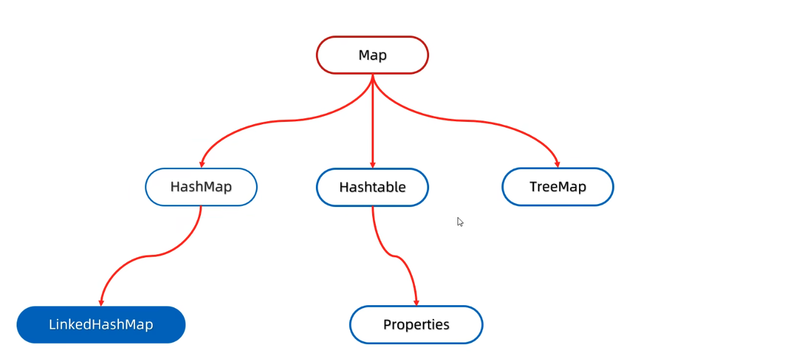
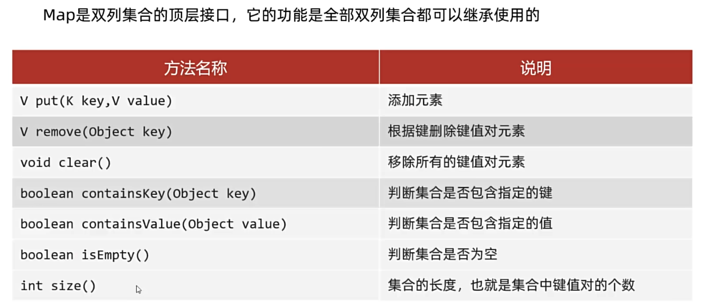
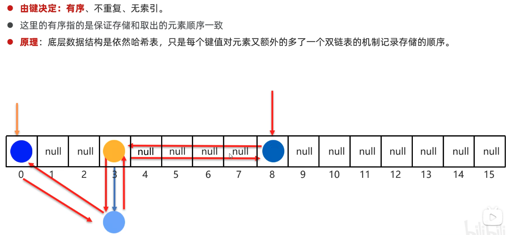
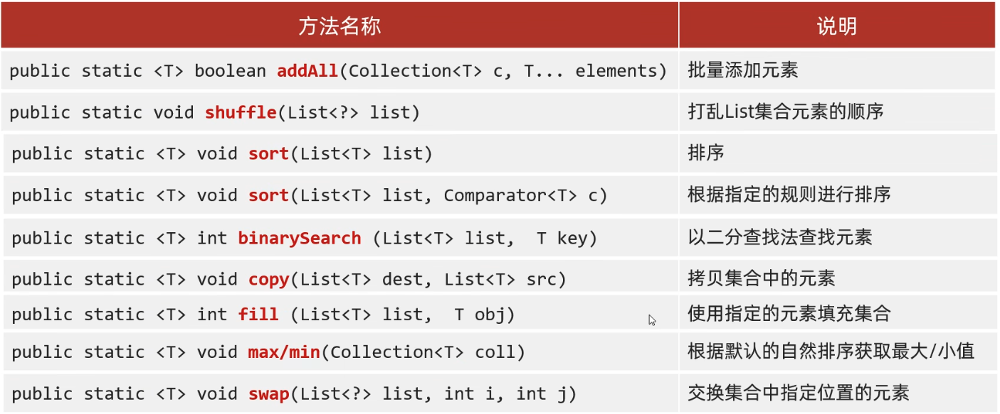
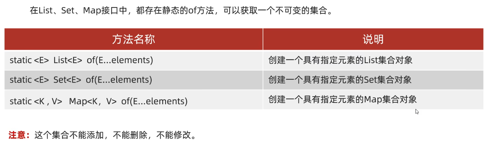

# 双列集合

## 1、双列集合的特点

1. 双列集合一次需要存一对数据，分别为键和值

2. 键不能重复，值可以重复

3. 键和值是一一对应的，每一个键只能找到自己对应的值

4. 键＋值这个整体 我们称之为“键值对” 或者 “键值对对象”，在了java中叫做“Entry对象”



## 2、Mpa常见API

**put: 添加、覆盖**



```java
//创建Map集合的对象
Map<String, String> m = new HashMap<>();

//添加元素
m.put("郭靖", "黄蓉");
m.put("韦小宝","沐剑屏");
m.put("杨过","小龙女");

//put方法的细节：
//在添加数据的时候，如果键不存在，那么直接把键值对对象添加到map集合当中,方法返回null
//在添加数据的时候，如果键是存在的，那么会把原有的键值对对象覆盖，会把被覆盖的值进行返回。

String value2 = m.put("韦小宝", "双儿");//沐剑屏

//删除
String result = m.remove("郭靖");//黄蓉

//清空
m.clear();

//判断是否包含
boolean keyResult = m.containsKey("郭靖");
boolean valueResult = m.containsValue("小龙女2");

//判断是否为空
boolean result = m.isEmpty();

//集合的长度
int size = m.size();

//打印集合
System.out.println(m);
```

## 3、Map的遍历方式

### (1)键找值

```java
//获取所有的键，把这些键放到一个单列集合当中
Set<String> keys = map.keySet();
//2遍历单列集合，得到每一个键
for (String key : keys) {
    //3 利用map集合中的键获取对应的值  get
    String value = map.get(key);
    System.out.println(key + " = " + value);
}
```

### (2)键值对

```java
//通过键值对对象进行遍历
//1通过一个方法获取所有的键值对对象，返回一个Set集合
//2遍历entries这个集合，去得到里面的每一个键值对对象
for (Map.Entry<String, String> entry :  map.entrySet()) {//entry  --->  "御龙骑士","尹志平"
    //3利用entry调用get方法获取键和值
    System.out.println(entry.getKey() + "=" + entry.getValue());
}
```

### (3)Lambda表达式

```java
//forEach其实就是利用第二种方式进行遍历，依次得到每一个键和值  再调用accet方法
map.forEach(new BiConsumer<String, String>() {
    @Override
    public void accept(String s, String s2) {
        System.out.println(s + " " + s2);
    }
});

map.forEach((s, s2) -> System.out.println(s + "=" + s2));
```

## 4、HashMap

1. HashMap是Map里面的一个实现类。

2. 没有额外需要学习的特有方法，直接使用Map里面的方法就可以了。

3. 特点都是由键决定的：无序、不重复、无索引

4. Hash Map跟Hashset底层原理是一模一样的，都是哈希表结构

5. 依赖hashcode方法和equals方法保证键的唯一

6. **如果键存储的是自定义对象，需要重写hashCodle和equal5方法**

​	如果值存储自定义对象，不需要重写hashCode 和equals方法

### 5、LinkedHashMap



## 6、TreeMap

**TreeMap**

​	TreeMap跟Treeset底层原理一样，都是红黑树结构的。

​	由键决定特性：不重复、无索引、可排序

​	可排序：对键进行排序。

​	注意：默认按照键的从小到大进行排序，也可以自己规定键的排序规则

**代码书写两种排序规则**

​	实现Comparable接口，指定比较规则。

​	创建集合时传递Comparator比较器对象，指定比较规则。

# 可变参数、Collections、不可变集合

## 1、可变参数

1. 可变参数本质上就是一个数组

2. 作用：在形参中接收多个数据

3. 格式：数据类型…参数名称

​	举例：int..a

4. 注意事项：

​	形参列表中可变参数只能有一个

​	可变参数必须放在形参列表的最后面

```java
public static void main(String[] args) {
    int sum = getSum(1, 2, 3, 4, 5, 6, 7, 8, 9, 10);
    System.out.println(sum);
}

//底层：
//可变参数底层就是一个数组
//只不过不需要我们自己创建了，Java会帮我们创建好
public static int getSum(int...args){
    int sum = 0;
    for (int i : args) {
        sum = sum + i;
    }
    return sum;
}
```

## 2、Collections

java.util.Collections: 是集合工具类

作用: collections不是集合，而是集合的工具类。



## 3、不可变集合

### (1)创建不可变集合的应用场景

如果某个数据不能被修改，把它防御性地拷贝到不可变集合中是个很好的实践。

当集合对象被不可信的库调用时，不可变形式是安全的。

简单理解：不想让别人修改集合中的内容

### (3)创建不可变集合的书写格式



#### 创建不可变的List和Set集合

```java
//1.创建不可变的List集合
List<String> list = List.of("zhangsan", "lisi", "wangwu");

//2.创建不可变的Set集合
Set<String> set1 = Set.of("zhangsan", "lisi", "wangwu");
//报错,当我们要获取一个不可变的set集合时, 里面的参数一定要保证唯一性
Set<String> set2 = Set.of("zhangsan", "zhangsan", "lisi", "wangwu");
```

#### 创建不可变的Map集合

细节1：键是不能重复的, 默认<key, value>组合

```java
Map<String, String> map = Map.of("张三", "南京", "张三", "北京", "王五", "上海",
        "赵六", "广州", "孙七", "深圳", "周八", "杭州",
        "吴九", "宁波", "郑十", "苏州", "刘一", "无锡",
        "陈二", "嘉兴");
```

细节2：Map里面的of方法，参数是有上限的，最次只能传递20个参数，10个键值对如果我们要传递多个键值对对象，数量大于10个，在Map按口中还有一个方法Map.ofEntries()

```java
//创建一个普通的Map集合
HashMap<String, String> hm = new HashMap<>();
hm.put("张三", "南京");
hm.put("李四", "北京");
hm.put("王五", "上海");

//利用上面的数据来获取一个不可变的集合
//获取到所有的键值对对象（Entry对象）
Set<Map.Entry<String, String>> entries = hm.entrySet();
//把entries变成一个数组
Map.Entry[] arr1 = new Map.Entry[0];
//toArray方法在底层会比较集合的长度跟数组的长度两者的大小
    //如果集合的长度 > 数组的长度 ：数据在数组中放不下，此时会根据实际数据的个数，重新创建数组
    //如果集合的长度 <= 数组的长度：数据在数组中放的下，此时不会创建新的数组，而是直接用
Map.Entry[] arr2 = entries.toArray(arr1);
//不可变的map集合
Map map = Map.ofEntries(arr2);

// 简洁写法
Map<Object, Object> map = Map.ofEntries(hm.entrySet().toArray(new Map.Entry[0]));

//copyOf方法, 本质也是Map.ofEntries(hm.entrySet().toArray(new Map.Entry[0]))
Map<String, String> map = Map.copyOf(hm);
```